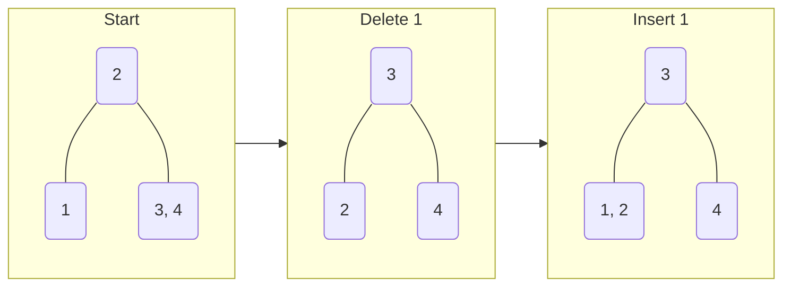
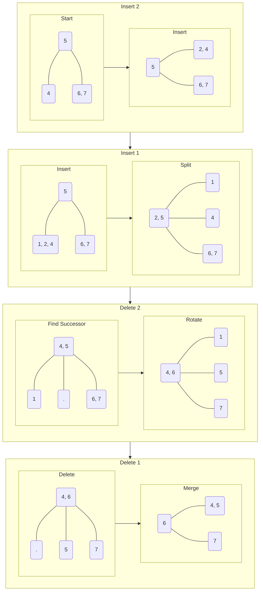

---
{"publish":true,"created":"11/04/25, 14:04","modified":"2025-11-21T21:10:01.953+02:00","tags":["Academia","Assignment","Data-structures"],"cssclasses":""}
---

# 1a
$$
\displaylines{
\text{Let an operation of adding an element to a dynamic array be as following:} \\
1. \text{If array is full, increase its size by a factor of } 1.1 \\
2. \text{Add element to the end} \\
\text{Calculate amortized complexity of adding an element in such array} \\
\\
\text{Solution:} \\
\text{Let } n \text{ be size of array} \\
\text{Let } k \text{ be amount of elements in array} \\
\text{Let } n_{0} = 1 \\
\text{Let } c_{1}, \dots, c_{k} \text{ be additions with resizing} \\
\forall i \in [1, k]: c_{i} = 1 + r_{i} \\
\text{Resizing will be done at capacities } 1.1^{0}, 1.1, 1.1^{2}, \dots, 1.1^{k} \\
\text{Let } 1.1^{k} = n \implies k = \log_{1.1}(n) \\
\text{Each resizing takes } r_{i} = 1.1^{i} \text{ copy operations} \\
\implies \sum_{i=1}^{n} c_{i} = \sum_{i=1}^{n} 1 + \sum_{i=0}^{k} r_{i} = n + \sum_{i=0}^{k} 1.1^{i} = n + \frac{1(1.1^{k+1}-1)}{0.1} = \\
= n + 10(1.1n - 1) = 12n - 10 \approx 12n \\
\implies \boxed{ \text{Amortized complexity of addition in such array is } \frac{12n}{n} = 12 = O(1) } \\
}
$$
# 1b
$$
\displaylines{
\text{What is the advantage and disadvantage of multiplying array size by } 1.1 \\
\text{in comparison to multiplying it by } 2? \\
\\
\text{Solution:} \\
\text{Advantage is in using much less excess memory when resizing} \\
\text{and not doing any more additions} \\
\\
\text{Disadvantage is in a much bigger constant multiplier underneath } O(1) \\
\text{Meaning that although addition is still done in constant time} \\ \text{it is in fact more costly by a significant factor} \\
}
$$
# 2
$$
\displaylines{
\text{Our goal is to make a data sturcture that does the following:} \\
1. \quad \text{push\_back} \\
2. \quad \text{push\_front} \\
3. \quad \text{pop\_back} \\
4. \quad \text{pop\_front} \\
5. \quad \text{get(i)} \\
\text{Preferrably, in O(1), or at least amortized O(1)} \\
\\
\text{Solution:} \\
\text{We will implement a circular dynamic array} \\
}
$$
```python
class CircularDynamicArray:
	array: Array[Any] # storage array
	capacity: int     # current capacity, doubled if full
	size: int         # current number of elements in array
	start: int        # physical index of "start"
```
$$
\displaylines{
\text{Internal operations will include:} \\
}
$$
```python
# Return physical index based on "logical" index, O(1)
def physical_index(self, i):
  # return "circular" index
  return (self.start + i) % self.capacity

# Resizing(doubling) is O(n)
# but amortized O(1), as shown many times in class
# and in exercise 1a with multiplier 1.1
def resize(self):
  # double the capacity, allocate new array
  new_capacity = self.capacity * 2
  new_array = Array[new_capacity]

  # copy all existing elements
  for i in range(self.size):
    new_array[i] = self.array[self.physical_index(i)]

  # update internal state
  self.array = new_array
  self.capacity = new_capacity
  self.start = 0
```
$$
\displaylines{
\text{Interface will include:} \\
}
$$
```python
def is_empty(self):
  return self.size == 0

# O(1) + possible resizing, amortized O(1)
def push_back(self, value):
  if self.size == self.capacity:
	self.resize()
  # regular push to the end
  self.array[self.physical_index(self.size)] = value
  self.size += 1

# O(1) + possible resizing, amortized O(1)
def push_front(self, value):
  if self.size == self.capacity:
	self.resize()
  # push to the beginning, adjust start
  self.start = (self.start - 1 + self.capacity) % self.capacity
  self.array[self.start] = value
  self.size += 1

# Pop from the "logical" end, O(1)
def pop_back(self):
  if self.is_empty():
	error "Empty"
  self.size -= 1
  return self.array[self.physical_index(self.size)]

# Pop from the "logical" start, O(1)
def pop_front(self):
	if self.is_empty():
		error "Empty"
	value = self.array[self.start]
	# move logical start
	self.start = (self.start + 1) % self.capacity
	self.size -= 1
	return value
```
$$
\displaylines{
\text{Resizing is amortized O(1), proof by the "banking" method:} \\
\text{Let each insertion add 3 credits to the account} \\
\text{Let capacity be } n \\
\text{After } n \text{ insertions we have } 3n \text{ credits} \\
\text{We need to resize, we will use } n \text{ credits for copying} \\
\text{Every deletion is checking if empty and deletion} \\
\implies n \text{ deletions would use the other } 2n \text{ credits} \\
\implies \text{All operations are at most amortized O(1)} \\
\text{Space required is O(n)} \\
}
$$
# 3a
$$
\displaylines{
\text{Let } B \text{ be a tree of order } m \\
\text{Let } x \text{ be a minimal element of the tree} \\
\text{Prove or disprove: deletion and immediate insertion of $x$ does not change the tree} \\
\\
\text{Disproof:} \\
\text{Let } m = 3 \\
}
$$

# 3b
$$
\displaylines{
\text{Let } B \text{ be a tree of order } m \\
\text{Let } x \text{ be smaller than any element of the tree} \\
\text{Prove or disprove: insertion and immediate deletion of $x$ does not change the tree} \\
\\
\text{Proof:} \\
\text{Let } h \text{ be height of the } B\text{-tree} \\
\text{Base case. Let } h = 1 \\
\text{Tree is a single leaf (root)} \\
\text{If root has } k < m - 1 \text{ keys, insertion and deletion do not change anything} \\
\text{(no splits, no merges) hence the structure is preserved} \\
\text{Let } k = m - 1 \\
\text{Insertion of } x \text{ will then trigger a split:} \\
\text{Root with one element } M \\
\text{Two children with } \left\lceil  \frac{m}{2}  \right\rceil - 1 \text{ keys} \\
x \text{ is a minimal element} \implies x \text{ is in the left child} \\
\text{Deletion of } x \text{ will then trigger an underflow:} \\
\text{Right sibling has a minimum number of keys and there is no left sibling} \\
\implies \text{Merge is necessary} \\
\implies \boxed{ \text{Tree now has a single node with original keys} } \\
\\
\text{Induction step. } \\
\text{Let } \forall h' \leq h: B(h') \text{ is unchanged by insertion and immediate deletion of minimal element} \\
\text{Let } B \text{ be a tree of height } h + 1 \\
\text{Case 1. Insertion of } x \text{ does not trigger a split} \\
\implies \boxed{ \text{Deletion of } x \text{ does not trigger borrow or merge and we are done} } \\
}
$$
$$
\displaylines{
\text{Case 2. Insertion of } x \text{ does trigger a split, leftmost leaf after insertion has } m \text{ keys, split} \\
\text{Two leftmost leaves now have } \left\lceil  \frac{m}{2}  \right\rceil - 1 \text{ keys} \\
\text{Height of the tree is at most } h + 2 \\
\text{Deletion of } x \text{ will trigger an underflow in leftmost leaf} \\
\text{Right sibling has a minimal amount of keys, there is no left sibling} \\
\implies \text{Merge is necessary} \\
\text{Case 2.1 Height of the tree is } h + 1 \\
\implies \text{Tree without leaf level has height } h \implies \text{It is restored after deletion} \\
\text{Leaf level after merge is also restored} \implies \boxed{ B \text{ is unchanged after deletion} } \\
\text{Case 2.2 Height of the tree is } h + 2 \\
\implies \text{Tree was full on insertion and now has a new root with one key } R' \\
\implies \text{On each level except root, two leftmost nodes have } \left\lceil  \frac{m}{2}  \right\rceil - 1 \text{ keys} \\
\implies \text{Deletion of $x$ triggers an equivalent merge on each level up to the root:} \\
\text{Let } L_{1}, L'_{1} \text{ be two leftmost nodes on level $k$ after insertion} \\
\text{On deletion, } \forall k \in [1, h]: L_{k} \text{ has } \left\lceil  \frac{m}{2}  \right\rceil - 2 \text{ keys} \\
\implies \text{On each level, merge occurs and restores original nodes with } m - 1 \text{ keys} \\
\implies \boxed{ B \text{ is restored to its original state after deletion} } \\
\implies \text{By Induction } \boxed{ \forall h \in \mathbb{N}: B \text{ is restored after insertion and immediate deletion of } x } \\
}
$$
# 3c
$$
\displaylines{
\text{Let } B \text{ be a tree of order } m \\
\text{Let } w, z: w > z \text{ be smaller than any element of the tree} \\
\text{Prove or disprove: insertion of } w, z \text{ and immediate deletion of } w, z \text{ does not change the tree} \\
\\
\text{Disproof:} \\
\text{Let } m = 3 \\
}
$$

# 4
$$
\displaylines{
\text{Prove that in-order traversal of a BST returns all elements of the tree in sorted order} \\
\\
\text{Proof:} \\
\text{Let } h \text{ be height of the tree} \\
\text{Base case. Let } h = 1 \\
\text{Tree has one element, it is returned by in-order traversal, the order is trivially sorted} \\
\text{Induction step.} \\
\text{Let } \forall h' \leq h: \text{in-order traversal over } T(h') \text{ returns its elements in sorted order} \\
\text{Let } T \text{ be a tree of height } h + 1 \\
\text{Let } T \text{ be represented as } T_{L} \leftarrow R \to T_{R} \\
\text{Where } R \text{ is root and } T_{L}, T_{R} \text{ are left and right sub-trees accordingly} \\
\text{Let } IO(T) \text{ be an ordered set of elements returned by in-order traversal of } T \\
\text{In-order traversal will return elements in the following order:} \\
IO(T) = IO(T_{L}) + R + IO(T_{R}) \\
T_{L}, T_{R} \text{ are trees of height } h \\
\implies \text{By inductive hypothesis } IO(T_{L}), IO(T_{R}) \text{ return sorted sets of elements of } T_{L}, T_{R} \\
\left\{\begin{array}{}
\forall x \in T_{L}: R > x \\
\forall x \in T_{R}: R < x \\
\end{array}\right. \implies \boxed{ IO(T) = IO(T_{L}) + R + IO(T_{R}) \text{ is a sorted set of elements of } T } \\
\implies \text{By Induction } \boxed{ \forall h \in \mathbb{N}: IO(T) \text{ is sorted} } \\
}
$$
