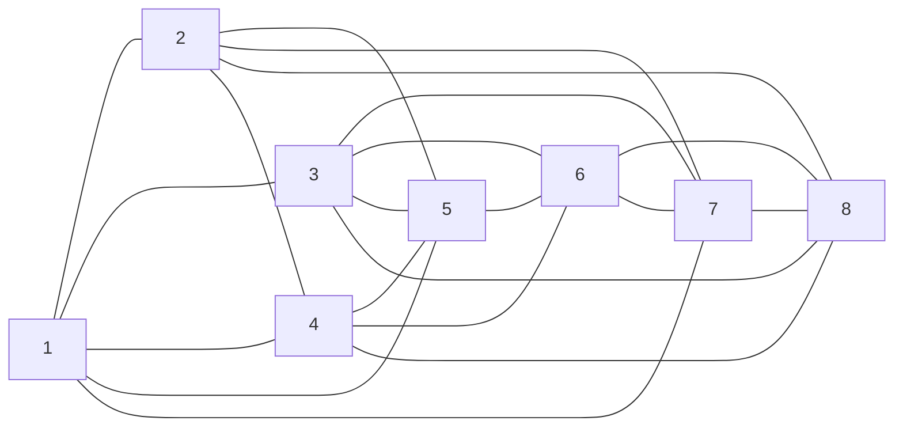
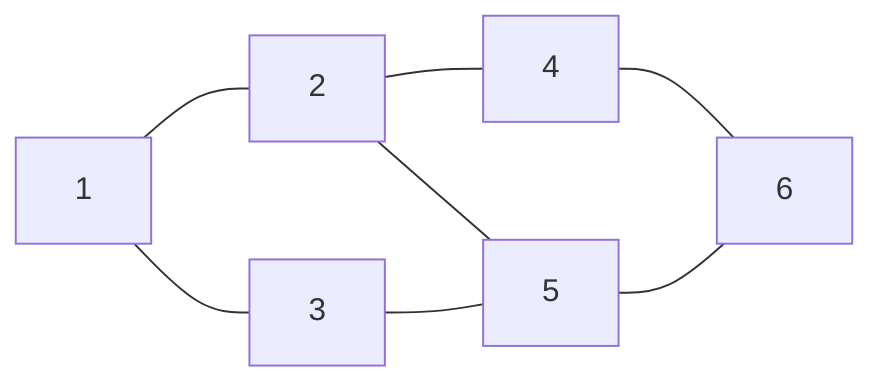
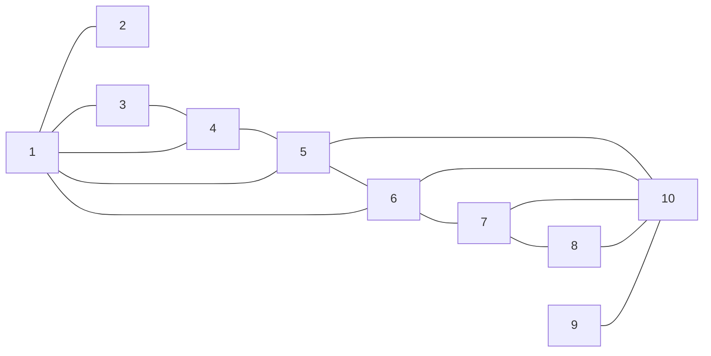
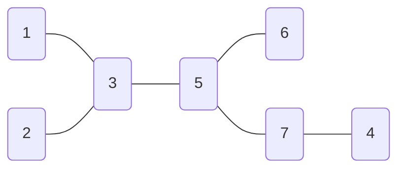
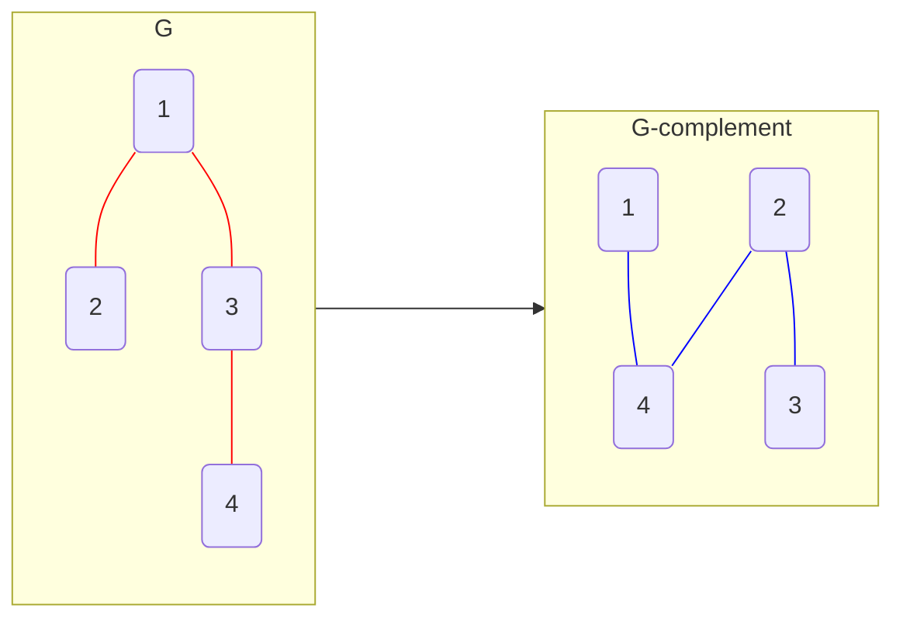
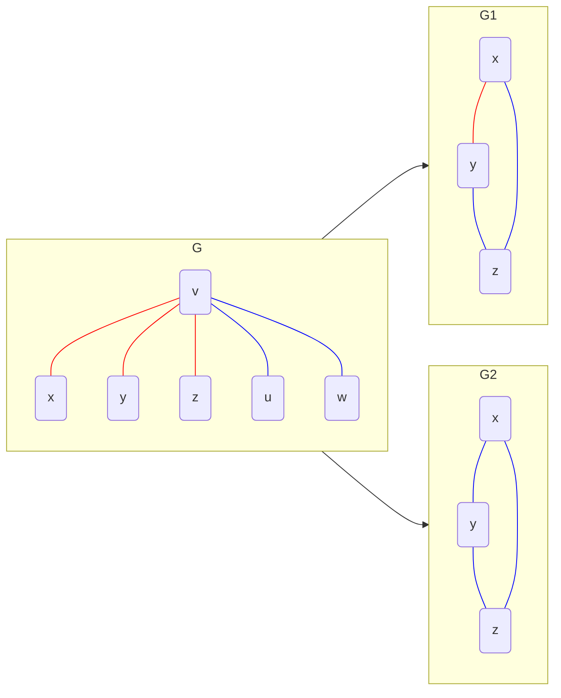

---
{"publish":true,"created":"27/01/25, 20:01","modified":"2025-11-21T21:10:02.162+02:00","tags":["Academia","Assignment","Discrete-math"],"cssclasses":""}
---

### Discrete maths Exercise 12
$$
\displaylines{
\left|\begin{array}{c|c|c}
\text{Proof} & \text{Disproof} & \text{Question no. and section} \\
X &  & \text{Warm-up, question 1} \\
 & X & \text{Warm-up, question 2} \\
 & X & \text{Warm-up, question 3} \\
X &  & \text{Warm-up, question 4} \\
X &  & \text{Warm-up, question 5} \\
 \\
X &  & \text{Not warm-up, question 1a} \\
 & X & \text{Not warm-up, question 1b} \\
X &  & \text{Not warm-up, question 2} \\
X &  & \text{Not warm-up, question 3} \\
X &  & \text{Not warm-up, question 6} \\
 & X & \text{Not warm-up, question 7a} \\
X &  & \text{Not warm-up, question 7b} \\
X &  & \text{Not warm-up, question 7c} \\
X &  & \text{Not warm-up, question 8a} \\
X &  & \text{Not warm-up, question 8b} \\
X &  & \text{Not warm-up, question 9a} \\
X &  & \text{Not warm-up, question 9b} \\
 & X & \text{Not warm-up, question 10a} \\
X &  & \text{Not warm-up, question 10b} \\
X &  & \text{Not warm-up, question 10c} \\
X &  & \text{Not warm-up, question 10d} \\
\end{array}\right|
}
$$
# Warm-up
$$
\displaylines{
\text{Let } G = (V, E) \\
\text{Prove or disprove that exists a simple graph such that the degrees of it's vertices are:} \\
}
$$
### 1
$$
\displaylines{
5, 5, 5, 5, 5, 5, 5, 5 \\
\\
\text{Proof:} \\
V = \Set{ v_{1}, v_{2}, \dots, v_{8} } \\
\text{By the Hand-Shaking lemma: } \sum_{v \in V} deg(v) = 2 \cdot \lvert E \rvert \\
\sum_{v \in V} deg(v) = 5 \cdot \lvert V \rvert = 5 \cdot 8 = 40 \\
\implies 2 \cdot \lvert E \rvert = 40 \implies \lvert E \rvert = 20 \\
G \text{ has } 8 \text{ vertices} \implies \text{maximum number of edges in } G \text{ is } \frac{8 \cdot 7}{2} = \frac{56}{2} = 28 \\
\text{And there are at least two vertices with the same degree} \\
\implies G \text{ might exist} \\
}
$$

### 2
$$
\displaylines{
1, 2, 2, 3, 4, 5 \\
\\
\text{Disproof:} \\
V = \Set{ v_{1}, v_{2}, \dots, v_{6} } \\
\sum_{v \in V} deg(v) = 1 + 2 + 2 + 3 + 4 + 5 = 17 \\
\implies 2 \cdot \lvert E \rvert = 17 \implies G \text{ doesn't exist} \\
}
$$
### 3
$$
\displaylines{
1, 1, 2, 3, 4, 5 \\
\\
\text{Disproof:} \\
\text{Let such a graph exist} \\
V = \Set{ v_{1}, v_{2}, \dots, v_{6} } \\
\sum_{v \in V} deg(v) = 1 + 1 + 2 + 3 + 4 + 5 = 16 \\
\implies 2 \cdot \lvert E \rvert = 16 \implies \lvert E \rvert = 8 \\
\text{Let us try to build this graph:} \\
\text{Let } deg(v_{1}) = 5 & WLOG \\
\implies \Set{ v_{2}, v_{1} }, \Set{ v_{3}, v_{1} } \in E \\
\text{Let } deg(v_{2}) = deg(v_{3}) = 1 & WLOG \\
\text{This means, that there can be no more edges} \\
\text{going to } v_{1}, v_{2} \text{ or } v_{3} \\
\implies \text{In a subgraph } G' = (\Set{ v_{4}, v_{5},v_{6} }, E') \text{ there is a vertex with degree } 4 \\
\text{We can subtract one for the edge that is already there} \\
\implies \text{In a simple graph with 3 vertices there is a vertex with degree 3} \\
\text{Contradiction!} \implies G \text{ doesn't exist} \\
}
$$
### 4
$$
\displaylines{
2, 2, 2, 2, 3, 3 \\
\\
\text{Proof:} \\
V = \Set{ v_{1}, v_{2}, \dots, v_{6} } \\
\sum_{v \in V} deg(v) = 2 + 2 + 2 + 2 + 3 + 3 = 14 \\
\implies 2 \cdot \lvert E \rvert = 14 \implies \lvert E \rvert = 7 \\
\text{And there are at least two vertices with the same degree} \\
\implies G \text{ might exist} \\
}
$$

### 5
$$
\displaylines{
\text{Simple graph with 100 vertices such that for every } 1 \leq k \leq 5 \\
\text{there are } 20 \text{ vertices of degree } k \\
\\
\text{Proof:} \\
G \text{ is a graph containing 10 of the following connected components:} \\
}
$$

---
# Not warm-up
## 1a
$$
\displaylines{
\text{Let } G = (V, E) \\
\text{Prove or disprove:} \\
\text{if } \forall u, v \in V: (u, v) \not\in E \land deg(v)+deg(u) \geq \lvert V \rvert - 1 \implies G \text{ is connected} \\
\\
\text{Proof:} \\
\text{Let } \lvert V \rvert = n \\
\text{Let } \forall u, v \in V: (u, v) \not\in E \land deg(v)+deg(u) \geq \lvert V \rvert - 1 \\
\text{Let } \delta_{G} = 0 \\
\implies \text{Maximum degree is } n - 2 \\
\exists u, v \in V: deg(v) = \delta_{G} \implies \delta_{G} + deg(u) \geq n - 1 \\
\implies deg(u) \leq n - 2 \text{ and } deg(u) \geq n - 1 - \text{ Contradiction!} \\
\implies \delta_{G} \geq 1 \\
\text{Let } \Set{ u, v } \not\in E \\
\text{There are } n - 2 \text{ vertices besides } u, v \\
deg(v) + deg(u) \geq n - 1 \\
\implies \text{There are } n-1 \text{ edges and } n-2 \text{ possible "destinations"} \\
\implies \text{By the pigeonhole principle, there are at least 2 edges going to the same vertex} \\
\text{There can be no more than one edge from one vertex to another} \\
\implies \text{These 2 edges are } \Set{ v, w }, \Set{ w, u } \\
\implies w \in \Gamma(v) \cap \Gamma(u) \implies u, v \text{ are in the same connected component} \\
\implies \boxed{ G \text{ is connected} } \\
}
$$
## 1b
$$
\displaylines{
\text{Let } G = (V, E) \\
\text{Prove or disprove: } G \text{ is connected} \iff \exists u, v \in V: deg(v)deg(u) \geq \lvert V \rvert^{2} - \lvert V \rvert \\
\\
\text{Disproof:} \\
\text{Let } \lvert V \rvert = n \\
\text{Let } u, v \in V \\
deg(u) \leq n-1 \\
deg(v) \leq n-1 \\
\implies deg(u)deg(v) \leq (n-1)(n-1) < n(n-1) = n^{2}-n = \lvert V \rvert^{2} - \lvert V \rvert \\
\implies \exists u, v \in V: deg(v)deg(u) \geq \lvert V \rvert^{2} - \lvert V \rvert \text{ is always False (a contradiction)} \\
\boxed{ \text{But "} G \text{ is connected" is not a contradiction} } \\
}
$$
## 2
$$
\displaylines{
\text{Prove by induction there for any tree with $n \geq 2$ vertices has at least 2 leaves.} \\
\\
\text{Proof:} \\
\text{Base case. Let } n = 2 \\
\text{The only tree with 2 vertices is the one with an edge between them:} \\
G = (\Set{ v_{1}, v_{2} }, \Set{ \Set{ v_{1}, v_{2} } }) \\
deg(v_{1}) = deg(v_{2}) = 1 \implies \text{There are 2 leaves} \\
\text{Induction step. Let the stated hold for any tree with } n \text{ vertices} \\
\text{Let } G = (V, E) \text{ be a tree with } n+1 \text{ vertices} \\
\text{Let } v \in V, deg(v) = \delta_{G} \\
G \text{ is a tree} \implies G \text{ is connected} \implies \delta_{G} \geq 1 \implies deg(v) > 0 \\ 
\text{Every tree has at least 1 leaf} \\
\implies \delta_{G} = 1 \implies deg(v) = 1 \\
\text{Let } u \in \Gamma(v) \\
G' = G \setminus \Set{ v } \text{ is a tree with } n \text{ vertices} \\
\implies G' \text{ has at least 2 leaves} \\
\text{If } u \text{ is not a leaf of } G', \text{ then } G \text{ has at least 2 leaves from $G'$ and leaf } v \\
\text{If } u \text{ is a leaf of } G', \text{ then } G \text{ has at least 1 leaf  from $G'$ and leaf } v \\
\implies G \text{ has at least 2 leaves} \\
\text{Base case + Induction step} \implies \boxed{ \text{Proved by Induction} } \\ 
}
$$
## 3
$$
\displaylines{
\text{Prove: undirected graph G = (V, E) is a tree iff} \\
\text{there exists a single simple path between any of it's vertices} \\
\\
\text{Proof:} \\
\text{Let } G = (V, E) \text{ is a tree} \\
\text{Let } u, v \in V \\
G \text{ is connected} \implies \text{exists a simple path from } u \text{ to } v \\
\text{Let there exist 2 different paths from } u \text{ to } v \\
\implies \text{exists a simple path } (u, \dots, v, \dots, u) \text{ which is a cycle} \\
G \text{ is acyclic} - \text{Contradition!} \\
\implies \boxed{ \text{Simple path from } u \text{ to } v \text{ is unique} } \\
\\
\text{Let there exist a single simple path between any vertices of } G = (V, E) \\
\implies G \text{ is connected by definition} \\
\text{Let } u, v \in V \\
\text{Let there exist a cycle from } u \text{ to } u \\
(u, \dots, v, \dots, u) \\
\text{Then there exist two different paths from } u \text{ to } v - \text{Contradiction!} \\
\implies G \text{ is acyclic} \implies \boxed{ G \text{ is a tree} } \\
}
$$
## 4
$$
\displaylines{
\text{An undirected, acyclic graph is called a forest.} \\
\text{Let } G = (V, E) \text{ be a forest with $c$ connected components.} \\
\text{Find a closed formula for } \lvert E \rvert  \\
\\
\text{Solution:} \\
\text{Forest is a graph where each connected component is a tree} \\
\text{Let } G_{1} = (V_{1}, E_{1}), \dots, G_{c} = (V_{c}, E_{c}) \text{ be connected components of } G \\
\bigcup_{i=1}^{c} V_{i} = V \\
\forall i, j \in [1, c]: i \neq j \implies V_{i} \cap V_{j} = \emptyset \\
\implies \lvert V \rvert = \left\lvert  \bigcup_{i=1}^{c} V_{i} \right\rvert = \sum_{i=1}^{c} \lvert V_{i} \rvert \\
\bigcup_{i=1}^{c} E_{i} = E \\
\forall i, j \in [1, c]: i \neq j \implies E_{i} \cap E_{j} = \emptyset \\
\text{Any tree has exactly } n-1 \text{ edges, where } n \text{ is the number of vertices in this tree} \\
\implies \lvert E \rvert = \left\lvert  \bigcup_{i=1}^{c} E_{i} \right\rvert = \sum_{i=1}^{c} \lvert E_{i} \rvert = \sum_{i=1}^{c} (\lvert V_{i} \rvert - 1) = \sum_{i=1}^{c} \lvert V_{i} \rvert - c \\
\implies \boxed{ \lvert E \rvert = \lvert V \rvert - c } \\
}
$$
## 5a
$$
\displaylines{
\text{How many connected components does an undirected acyclic graph $G = (V, E)$ with} \\
\lvert E \rvert = 10, \lvert V \rvert = 17 \text{ have?} \\
\\
\text{Solution:} \\
G \text{ is a forest} \\
\implies \lvert E \rvert = \lvert V \rvert - c, \text{ where } c \text{ is a number of connected components} \\
\implies 10 = 17 - c \implies c = 7 \\
\implies \boxed{ G \text{ has 7 connected components} } \\
}
$$
## 5b
$$
\displaylines{
\text{What is the minimal number of edges in an undireced graph } G = (V, E) \\
\text{with } \lvert V \rvert = n \text{ and } diam(G) = 2 \\ 
\\
\text{Solution:} \\
diam(G) = 2 \implies G \text{ is connected} \\
\implies \lvert E \rvert \geq n - 1 \\
\text{Is there such a graph with exactly } n-1 \text{ edges?} \\
\text{Yes, the star graph, where one vertex is connected to all others} \\
\text{and no other edges are present} \\
\implies \boxed{ \text{The minimal number of edges is } n-1 } \\
}
$$
## 6
$$
\displaylines{
\text{Let } G = (V, E) \text{ be a finite simple undirected connected graph} \\
\text{with a single cycle with } \lvert V \rvert \geq 3 \\
\text{Prove: } \lvert V \rvert = \lvert E \rvert \\
\\
\text{Proof:} \\
\text{Let } \Set{ u, v } \text{ be an edge in the cycle of } G \\
\text{If we remove this edge, we get an acyclic connected graph} \\
\implies G' = (V, E \setminus \Set{ \Set{ u, v } }) \text{ is a tree} \\
\implies \lvert E \setminus \Set{ \Set{ u, v } } \rvert = \lvert V \rvert - 1 = \lvert E \rvert - 1 \\
\implies \boxed{ \lvert V \rvert = \lvert E \rvert } \\
}
$$
## 7a
$$
\displaylines{
\text{Prove or disprove: there exists a tree graph with degrees of vertices as following:} \\
1, 1, 4, 3, 3, 1, 1 \\
\\
\text{Disproof:} \\
\text{Let } G = (V, E) \\
\sum_{v \in V} deg(v) = 1 + 1 + 4 + 3 + 3 + 1 + 1 = 14 \\
\implies 2 \cdot \lvert E \rvert = 14 \implies \lvert E \rvert = 7 = \lvert V \rvert \implies G \text{ has a cycle} \implies \boxed{ G \text{ is not a tree} } \\
}
$$
## 7b
$$
\displaylines{
\text{Prove or disprove: there exists a tree graph with degrees of vertices as following:} \\
1, 1, 3, 1, 3, 1, 2 \\
\\
\text{Proof:} \\
}
$$

## 7c
$$
\displaylines{
\text{Let } V = \Set{ 1, 2, \dots, n } \\
\text{Let } \Set{ d_{1}, d_{2}, \dots, d_{n} } \subseteq \mathbb{N} \\
\sum_{i=1}^{n} d_{i} = 2n-2 \\
\text{Prove: there exists a tree graph with vertices } V \text{ such that their degrees are } d_{1}, d_{2}, \dots, d_{n} \\
\\
\text{Proof:} \\
\text{Let } G = (V, E) \\
\lvert V \rvert = n \\
\sum_{v \in V} deg(v) = \sum_{i=1}^{n} d_{i} = 2n-2 = 2(n-1) = 2 \cdot \lvert E \rvert \\
\implies \lvert E \rvert = n-1 \\
\\
\text{Base case. Let } n = 1 \\
\text{One vertex with degree 0 is a tree } \\
\sum_{v \in V} deg(v) = 0 = 2n - 2 \\
\text{Induction step. Let the statement hold for } n \\
\text{Let } G = (V, E) \text{ be a tree graph satisfying the conditions with } n \text{ vertices} \\
G \text{ is a tree} \implies \exists v \in V: deg(v) = 1 \\
\text{Let } u \not\in V \\
\text{Let } G' = (V \cup \Set{ u }, E \cup \Set{ v, u }) \\
G' \text{ is also a tree} \\
\underbrace{ \sum_{w \in V \cup \Set{ u }} deg(w) }_{ \text{degrees in graph } G' } = \underbrace{ \sum_{w \in V} deg(w) }_{ \text{degrees in graph } G } + \underbrace{ deg(u) }_{ \text{just } 1 } \underbrace{ + 1 }_{ \text{1 new edge from } v } = 2n - 2 + 2 = 2n = \\
= 2(n+1)-2 \\
\implies \text{There exists a tree graph such that the condition holds for } n+1 \text{ vertices} \\
\implies \boxed{ \text{Proved by Induction} } \\
}
$$
## 8a
$$
\displaylines{
\text{Let } G = (V, E) \text{ be a connected graph} \\
\text{Prove: } \lvert V \rvert = n + 1, \lvert E \rvert = n \implies \exists v \in V: deg(v) = 1 \\
\\
\text{Proof:} \\
\text{Let } \lvert V \rvert = m \\
\lvert E \rvert = m - 1 \implies \text{Removing any edge will make } G \text{ disconnected} \\
\implies G \text{ is a minimal connected graph} \\
\text{Suppose } G \text{ has a cycle} \\
\text{Removing any edge from this cycle would still leave } G \text{ connected} - \text{Contradiction!} \\
\implies G \text{ has no cycles} \implies G \text{ is a tree} \\
\implies G \text{ has at least two leaves} \implies \boxed{ \exists v \in V: deg(v) = 1 } \\
}
$$
## 8b
$$
\displaylines{
\text{Let } G = (V, E) \text{ be a connected graph} \\
\text{Prove: } \lvert V \rvert = n, \lvert E \rvert = n - 1 \implies G \text{ is acyclic} \\
\\
\text{Proof:} \\
\text{Same proof as in 8a} \\
\text{Let } \lvert V \rvert = n \\
\lvert E \rvert = n - 1 \implies \text{Removing any edge will make } G \text{ disconnected} \\
\implies G \text{ is a minimal connected graph} \\
\text{Suppose } G \text{ has a cycle} \\
\text{Removing any edge from this cycle would still leave } G \text{ connected} - \text{Contradiction!} \\
\implies \boxed{ G \text{ has no cycles} } \\
}
$$
## 9a
$$
\displaylines{
\text{Let } G = (V, E) \text{ be a finite simple graph} \\
\text{Let } U = \Set{ v \in V | deg(v) \text{ is odd} } \\
\text{Prove: } \lvert U \rvert \text{ is even} \\
\\
\text{Proof:} \\
2 \cdot \lvert E \rvert = \sum_{v \in V} deg(v) = \sum_{v \in U} deg(v) + \underbrace{ \sum_{v \in V \setminus U} \underbrace{ deg(v) }_{ \text{even} } }_{ even } \\
\implies \sum_{v \in U} deg(v) \text{ must also be even} \\
\text{Sum of odd integers is only even when the number of such integers is even} \\
\implies \boxed{ \lvert U \rvert \text{ is even} } \\
}
$$
## 9b
$$
\displaylines{
\text{Prove:} \\
\text{If } G \text{ is connected and there exists an edge } e \text{ such that } G' = (V, E \setminus \Set{ e }) \text{ is not connected} \\
\text{Then } \exists v \in V: deg(v) \text{ is odd} \\
\\
\text{Proof:} \\
\text{Let } G = (V, E) \text{ be a connected graph} \\
\text{Let } e = \Set{ u, v } \in E \\
\text{Let } G' = (V, E \setminus \Set{ e }) \text{ be a not connected graph} \\
\\
\text{Let } \forall v \in V: deg(v) \text{ is even in } G \\
\text{We can state the following to be true:} \\
1. \quad \text{Degrees of } u \text{ and } v \text{ are odd in } G' \\
2. \quad \text{Degrees of all other vertices are even} \\
3. \quad u \text{ and } v \text{ are now in two different connected components} \\
\text{Let } G'_{v} = ([v]_{\sim}, E_{v}) \text{ be a subgraph over the connected component of } v \\
\text{Where } E_{v} = \Set{ \Set{ x, y } | x, y \in [v]_{\sim} } \\
\text{By the hand shaking lemma:} \\
2 \cdot \lvert E_{v} \rvert = \sum_{x \in [v]_{\sim}} deg(x) = \underbrace{ \sum_{x \in [v]_{\sim} \setminus \Set{ v }} deg(x) }_{ \text{even} } + \underbrace{ deg(v) }_{ \text{odd} }, \text{ which is odd} - \text{Contradiction!} \\
\implies \boxed{ \exists v \in V: deg(v) \text{ is odd} } \\
}
$$
## 10a
$$
\displaylines{
\text{Prove or disprove: if } G \text{ is connected, then } \overline{G} \text{ is not connected} \\
\\
\text{Disproof:} \\
}
$$

## 10b
$$
\displaylines{
\text{Prove or disprove: if } G \text{ is not connected then } \overline{G} \text{ is connected} \\
\\
\text{Proof:} \\
\text{Let } G \text{ be disconnected} \\
\implies G \text{ has at least two connected components} \\
\implies \text{There exists a way to divide } G \text{ into two disjoint graphs} \\
\text{Let } G_{1} = (V_{1}, E_{1}), G_{2} = (V_{2}, E_{2}) \text{ be graphs such that:} \\
V_{1} \cup V_{2} = V \\
V_{1} \cap V_{2} = \emptyset \\
\forall v \in V_{1}: \forall u \in V_{2}: \Set{ u, v } \not\in E \text{ or in other words } d(u, v) = \infty \\
\text{Let } \overline{G} = (V, \overline{E}) \text{ where } \overline{E} = \Set{ \Set{ u, v } | u, v \in V, \Set{ u, v } \not\in E } \\
\implies \forall v \in V_{1}: \forall u \in V_{2}: \Set{ u, v } \in \overline{E} \text{ or in other words } d(u, v) = 1 \\
\text{Let } v_{1}, v_{2} \in V_{1} \ (\text{or } V_{2} \text{ which is a symmetrical case}) & WLOG \\
\text{Let } u \in V_{2} \\
u \in \Gamma(v_{1}), u \in \Gamma(v_{2}) \implies \text{Exists a simple path } (v_{1}, u, v_{2}) \\ \implies d(v_{1}, v_{2}) \leq 2 \\
\implies \forall u, v \in V: d(u, v) < \infty \text{ in } \overline{G} \\
\implies \boxed{ \overline{G} \text{ is connected} } \\
}
$$
## 10c
$$
\displaylines{
\text{Prove or disprove: if } G \text{ is regular, then } \overline{G} \text{ is also regular} \\
\\
\text{Proof:} \\
\text{Let } G = (V, E) \\
\text{Let } \lvert V \rvert = n \\
\text{Let } \forall u, v \in V: deg(u) = deg(v) = k \\
\text{Let } \overline{G} = (V, \overline{E}) \\
\text{Let } v \in V \\
\Gamma(v) \text{ in } \overline{G} \text{ is equal to } V \setminus (\Gamma(v) \cup \Set{ v }) \text{ in } G \\
v \not\in \Gamma(v), \Gamma(v) \subseteq V \implies \lvert V \setminus (\Gamma(v) \cup \Set{ v }) \rvert = \lvert V \rvert - (\lvert \Gamma(v) \rvert + 1) = \lvert V \rvert - deg(v) - 1 = \\
= n - k - 1 \\
\implies \forall v \in V: deg(v) = n - k - 1 \text{ in } \overline{G} \\
\implies \boxed{ \overline{G} \text{ is regular} } \\
}
$$
## 10d
$$
\displaylines{
\text{Let } G = (V, E) \\
\text{Let } \lvert V \rvert = 6 \\
\text{Prove or disprove: either } G \text{ or } \overline{G} \text{ has a triangle (a cycle of length 3)} \\
\\
\text{Proof:} \\
\text{Let } v \in V \\
\text{There are } 5 \text{ other vertices in } V \\
\text{Any vertex can either be a neighbor of } v \text{ in } G \text{ or be a neighbor of } v \text{ in } \overline{G} \\
\implies \text{By the pigeonhole principle } v \text{ has at least } 3 \text{ neighbors in either } G \text{ or } \overline{G} \\
\text{Let } deg(v) \geq 3 \text{ in } G \quad (WLOG) \\
\text{Let } x, y, z \in V \text{ be the three neighbors of } v \\
\text{If any of edges } \Set{ x, y }, \Set{ x, z }, \Set{ y, z } \text{ are in } E \\
\text{Then } \boxed{ G \text{ has a triangle } (v, x, y), (v, x, z) \text{ or } (v, y, z) } \\
\text{If none of these edges are in } E \\
\text{Then all of them are in } \overline{E} \text{ and } \boxed{ \overline{G} \text{ has a triangle } (x, y, z) } \\
}
$$

---
