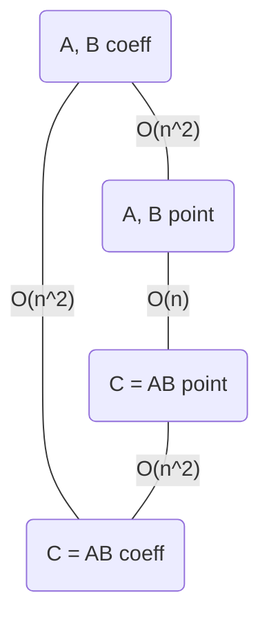
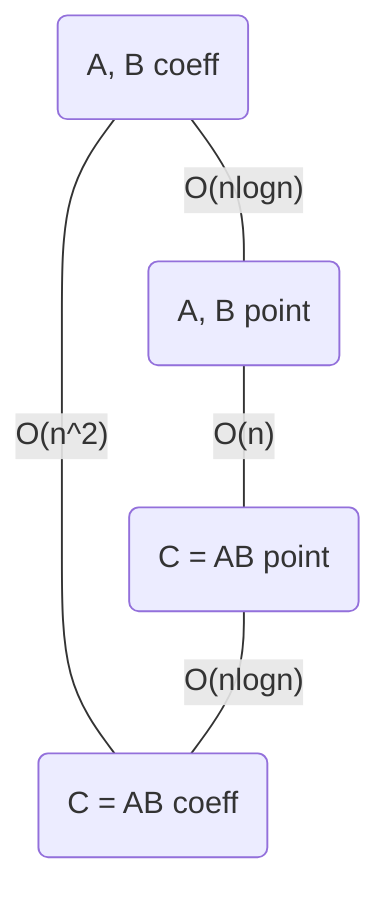

---
{"publish":true,"created":"28/10/25, 14:10","modified":"2025-11-21T21:10:13.899+02:00","tags":["Academia","Lecture","Algorithms-1"],"cssclasses":""}
---

# Naive polynomial multiplication

# Polynomial multiplication with FFT

# Evaluation with FFT
## Problem input
$$
\displaylines{
a_{0}, \dots, a_{n-1} \text{ coefficients of } A(x) \\
x_{0}, \dots, x_{n-1} \in \mathbb{F} \\
}
$$
## Problem output
$$
\displaylines{
y_{0}, \dots, y_{n-1} \in \mathbb{R}: \forall i \in [0, n-1]: A(x_{i}) = y_{i} \\
}
$$
## How does FFT work?
$$
\displaylines{
\text{Let } A(x) = \sum_{i=0}^{n-1} a_{i}x^{i} \\
\text{Let } \Set{ x_{0}, \dots, x_{n-1} } \subseteq \mathbb{R} \\
\\
\text{Let us represent } A(x) \text{ using Vandermonde matrix} \\
\displaylines{
V = \begin{pmatrix}
x_{0}^{0} & x_{0}^{1} & \dots & x_{0}^{n-1} \\
\vdots &  &  & \vdots \\
\vdots &  &  & \vdots \\
x_{n-1}^{0} & x_{n-1}^{1} & \dots & x_{n-1}^{n-1} \\
\end{pmatrix}, \vec{a} = \begin{pmatrix}
a_{0} \\
\vdots \\
a_{n-1} \\
\end{pmatrix} \\
\implies V \cdot \vec{a} = \begin{pmatrix}
y_{0} \\
\vdots \\
y_{n-1} \\
\end{pmatrix} = \vec{y} \\
\\
\text{This evaluation takes } O(n^{2}) \text{ time} \\
}
}
$$
#### Recursive algorithm on arbitrary x-points
$$
\displaylines{
\text{What does FFT propose we do to speed this process up?} \\
\text{Let } n \text{ be a power of 2} \\
\text{Let } A(x) = \sum_{i=0}^{n-1} a_{i}x^{i} \\
\text{Let } A_{even}(x) = \sum_{i=0}^{n/2-1} a_{2i}x^{i} \\ 
\text{Let } A_{odd}(x) = \sum_{i=0}^{n/2-1} a_{2i+1}x^{i} \\
\\
\implies A(x) = A_{even}(x^{2}) + x \cdot A_{odd}(x^{2}) \\
\\
\text{Applying this formula recursively, we can evaluate } A(x) \text{ for all points } x_{i} \\
}
$$
What would be the complexity of this algorithm?
$$
\displaylines{
T(n, m) = 2T\left( \frac{n}{2}, m \right) + O(m) \\
\text{Where } m \text{ is the number of points to evaluate} \\
\text{This number doesn't change at all in each recursion step,}\\
\text{it is always equal to the initial value of } n \\
}
$$
How do we address this?
$$
\displaylines{
\text{Let } x_{0}, \dots, x_{\frac{n}{2}-1} = -x_{\frac{n}{2}}, \dots, -x_{n-1} \\
}
$$
### Weak negation property #definition 
$$
\displaylines{
\text{Let sequence } (x_{0}, \dots, x_{k-1}) \text{ fulfill one of the following properties:} \\
1. \quad k = 1 \\
2. \quad \forall j \in \left[ 0, \frac{k}{2}-1 \right]: x_{\frac{k}{2}+j} = -x_{j} \\
}
$$
#### Recursive algorithm on points with a weak negation property
$$
\displaylines{
\text{Define } A_{even}(x), A_{odd}(x) \text{ the same way as previously} \\
\forall j \in \left[ 0, \frac{n}{2}-1 \right] : A(x_{j}) = A_{even}(x_{j}^{2}) + x_{j}A_{odd}(x_{j}^{2}) \\
A\left( x_{\frac{n}{2}+j} \right) = A(-x_{j}) = A_{even}(x_{j}^{2}) - x_{j}A_{odd}(x_{j}^{2}) \\
}
$$
What would be the complexity of this algorithm?
$$
\displaylines{
T(n) = 2T\left( \frac{n}{2} \right) + O(n) = O(n\log n) \\
\text{Now the number of points to evaluate is halved at each step} \\
\text{and everything works, right? Not exactly!} \\
\text{From the second step of the recursion, out points lose the weak negation property} \\
\text{And the algorithm still doesn't work} \\
}
$$
### Strong negation property #definition 
$$
\displaylines{
\text{Let sequence } (x_{0}, \dots, x_{k-1}) \text{ fulfill the weak negation property} \\
\text{Let, in addition } \left( x_{0}^{2}, \dots, x_{\frac{k}{2}-1}^{2} \right) \text{ fulfill the strong negation property, recursively(!)} \\
\text{Which points fulfill that strong negation property?} \\
\\
\left(\begin{array}{c|c}
k & x\text{-points} \\
1 & 1 \\
2 & 1, -1 \\
4 & 1, i, -1, -i \\
8 & 1, \frac{\sqrt{ 2 }}{2} + \frac{\sqrt{ 2 }}{2}i, i, -\frac{\sqrt{ 2 }}{2}+\frac{\sqrt{ 2 }}{2}i, -1, -\frac{\sqrt{ 2 }}{2} - \frac{\sqrt{ 2 }}{2}i, -i, \frac{\sqrt{ 2 }}{2}-\frac{\sqrt{ 2 }}{2}i \\
\vdots \\
\end{array}\right) \\
}
$$
We should probably generalize this
$$
\displaylines{
z = a + bi = r(\cos\theta + i\sin\theta) = rcis\theta = re^{i\theta} \\
\\
z_{1} \cdot z_{2} = cis(\theta_{1} + \theta_{2}) \\
}
$$
## n-th root of unity #definition 
$$
\displaylines{
(\omega)^{n} = 1 \\
\theta = \frac{2\pi}{k} \implies \omega = e^{i\theta} \implies (w)^{k} = (e^{i\theta})^{k} = e^{2\pi i} = 1 \\
}
$$
## Principal n-th root of unity #definition 
$$
\displaylines{
\omega_{n} = e^{\frac{2\pi i}{n}} \\
\forall k \in \mathbb{N}_{0} : ((\omega_{n})^{k})^{n} = e^{2\pi ki} = 1^{k} = 1 \\
\implies \forall k \in [0, n-1]: \omega_{n}^{k} \text{ is an n-th root of unity} \\
}
$$
Why is it interesting to us? Because $(\omega_{n}^{0}, \dots, \omega_{n}^{n-1})$ forms a sequence of points with strong negation property!
$$
\displaylines{
\text{Let us prove it} \\
\text{Let } j \in [0, n-1] \\
x_{j} = \omega_{n}^{j} \\
x_{\frac{n}{2}+j} = \omega_{n}^{\frac{n}{2} + j} \\
\omega_{n}^{j} = e^{\frac{2\pi j i}{n}} \\
\omega_{n}^{\frac{n}{2} + j} = e^{\pi i + \frac{2\pi j i}{n}} = e^{\pi i} \cdot \omega_{n}^{j} = -\omega_{n}^{j} \\
\implies (\omega_{n}^{0}, \dots, \omega_{n}^{n-1}) \text{ fulfills the weak negation property} \\
\\
\text{Let } j \in \left[ 0, \frac{n}{2}-1 \right] \\
(\omega_{n}^{k})^{2} = \omega_{n}^{2k} = \dots = \omega_{\frac{n}{2}}^{k} \\
\implies \left( (\omega_{n}^{0})^{2}, \dots, \left( \omega_{n}^{\frac{n}{2}-1} \right)^{2} \right) = \left( \omega_{\frac{n}{2}}^{0}, \dots, \omega_{\frac{n}{2}}^{\frac{n}{2}-1} \right) \\
\text{Applying this rule recursively via induction proves the strong negation property} \\
}
$$
#### Recursive algorithm on x-points with a strong property
$$
\displaylines{
\text{The algorithm is exactly the same as with a weak x-points property} \\
\text{This algorithm, finally, works and has the complexity of } O(n\log n) \\
}
$$
Pseudocode for this algorithm is as follows:
$$
\displaylines{
\begin{align}{}
& \ FFT(A(a_{0}, \dots, a_{n-1})): \\
1. &\quad \text{ if } n = 1 \\
2. &\quad \quad \text{ return } a_{0} \\
3. &\quad \text{ Let } A_{even} = (a_{0}, a_{2}, \dots, a_{n-2}) \\
4. &\quad \text{ Let } A_{odd} = (a_{1}, a_{3}, \dots, a_{n-1}) \\
5. &\quad \ P_{even} = FFT(A_{even}) \\
6. &\quad \ P_{odd} = FFT(A_{odd}) \\
7. &\quad \ \text{for } j = 0 \text{ to } \frac{n}{2} - 1: \\
8. &\quad \quad \ y_{j} = P_{even}[j] + \omega_{n}^{j} \cdot P_{odd}[j] \\
9. &\quad \quad \ y_{\frac{n}{2} + j} = P_{even}[j] - \omega_{n}^{j} \cdot P_{odd}[j] \\
10. &\quad \text{ return } (y_{0}, \dots, y_{n-1}) \\
\end{align} \\
}
$$
$$
\displaylines{
V = FFT = \begin{pmatrix}
1^{0} & 1^{1} & \dots & 1^{n-1} \\
(\omega_{n}^{1})^{0} & (\omega_{n}^{1})^{1} & \dots & (\omega_{n}^{1})^{n-1} \\
\vdots & \vdots &  & \vdots \\
(\omega_{n}^{n-1})^{0} & (\omega_{n}^{n-1})^{1} & \dots & (\omega_{n}^{n-1})^{n-1} \\
\end{pmatrix} \\
\vec{y} = FFT \cdot \vec{a} \\
\vec{a} = FFT^{-1} \cdot \vec{y} \\
FFT^{-1} = \frac{1}{n} \begin{pmatrix}
1^{0} & 1^{1} & \dots & 1^{n-1} \\
(\omega_{n}^{-1})^{0} & (\omega_{n}^{-1})^{1} & \dots & (\omega_{n}^{-1})^{n-1} \\
\vdots & \vdots &  & \vdots \\
(\omega_{n}^{-(n-1)})^{0} & (\omega_{n}^{-(n-1)})^{1} & \dots & (\omega_{n}^{-(n-1)})^{n-1} \\
\end{pmatrix} \\
\text{Negative powers of } \omega_{n} \text{ also form a sequence of points with strong negative property} \\
\text{Which means the interpolation algorithm has the same complexity as the evaluation one } \\
}
$$
