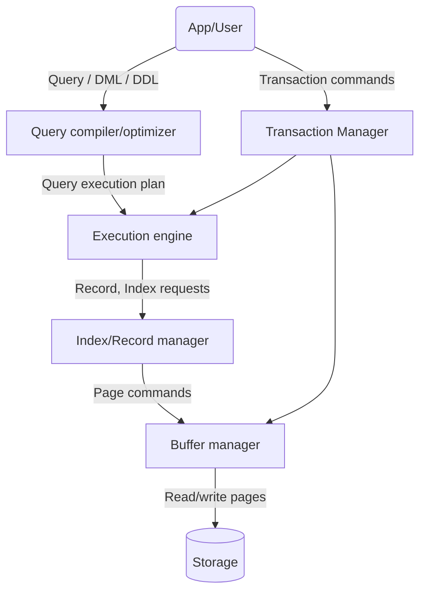

---
{"publish":true,"created":"17/12/25, 10:07","modified":"2026-03-24T15:00:17.004+02:00","tags":["Academia","Lecture","Databases"],"cssclasses":""}
---

# BCNF and 3NF
Can BCNF be problematic? It is lossless, but is it all that we want?
Turns out, yes, there are problematic examples!
- R(Film, Actor, Character)
- Character $\to$ Film
- Film, Actor $\to$ Character

Let us decompose on the first FD
- R1(Character, Film)
- R2(Character, Actor)

Both tables are in BCNF and it is indeed a lossless decomposition.
Let us insert some legal data into these tables!
- (Austin Powers, Austin Powers) $\to$ R1
- (Dr. Evil, Austin Powers) $\to$ R1
- (Austin Powers, Mike Myers) $\to$ R2
- (Dr. Evil, Mike Myers) $\to$ R1

And then join them back into R
- (Austin Powers, Mike Myers, Austin Powers)
- (Austin Powers, Mike Myers, Dr. Evil)

We got a violation of the second FD! Why? What happened?
It is indeed a problem of BCNF, sometimes it is too restrictive - it forces too much decomposition.
We would like to not only preserve the data (lossless), but to preserve FDs (dependency preservation)!
## Third normal form (3NF) #definition 
$$
\displaylines{
\text{Relation } R \text{ is in 3NF iff} \\
\text{A non-reflexive } A_{1}, \dots, A_{n} \to B_{1}, \dots, B_{m} \text{ can hold only if } \Set{ A_{1}, \dots, A_{n} } \text{ is a key in } R \\
\text{OR} \\
\forall i \in [1, m]: B_{i} \text{ is a part of a minimal key (so called prime attribute)} \\
}
$$
Clearly, 3NF is less restrictive than BCNF, it allows more FDs
### Decomposition to 3NF
How can we decompose the relation to be in 3NF?
- Using the BCNF lossless decomposition on FDs that violate 3NF only
	- This method is lossless, but we might still lose some FDs!
- Using another decomposition algorithm, called "Synthesis algorithm", that is both lossless and dependency-preserving!
---
# Server side
The high-level architecture of the server tier looks something like this

### Storage
We will talk about buffer manager and storage

|                  | Main memory                         | External memory                                               |
| ---------------- | ----------------------------------- | ------------------------------------------------------------- |
|                  | RAM, cache                          | HDD, SSD, removable storage                                   |
| Processor access | Directly by CPU                     | Requires loading the data into main memory                    |
| Volatility       | Volatile                            | Persistent, does not depend on power supply                   |
| Cost             | Expensive                           | Cheap                                                         |
| Access           | Tens of nanoseconds, less for cache | A few milliseconds, one page/sector at a time (typically 4KB) |
#### Main memory buffer management
The buffer manager of the DBMS asks to load pages from the external memory to frames of the buffer pool. The **buffer pool** is a collection of frames stored in the main memory for fast access. Choice of frame to load data into is defined by the **replacement policy**.
The buffer manager
- Decides which pages to load
- Decides which pages to override (replacement policy)
- Decides which page to write back to the external memory

Note that buffer manager cannot be replaced by the operating system
- DBMS may be able to anticipate access patterns
- DBMS then may also be able to perform prefetching
- DBMS needs the ability to force pages to disk

In main memory algorithms, the main cost factor are the **CPU operations**
In database algorithms, the main cost factor are the **I/O operations**, i.e. reading/writing pages from the external memory. We want to redesign algorithms to minimize that cost!
### I/O model of computation
- Assume the cost of reading/writing one page to be 1. The cost of the algorithm is then number of pages read/written
- We are interested in the **exact average cost**. $\Theta, O, \Omega$ do not suffice, the coefficient matters!
- We are able to make assumptions about the data itself, i.e. "tuple is small enough to fit into a page"
#### 2-way external merge sort
Imagine we have to sort 400Gb data with 16Gb RAM, is it possible?
Not with usual sorting algorithms, we simply won't be able to read the file!

2-way external merge sort is one of the solutions!
- Pass 1 - read a page, sort it in place, write it.
	- only one buffer page is used
- Pass 2 and on - read two pages, merge them into an output page, write output page
	- three buffer pages are used
	- Each time the output page is filled - write it to the end of the sorted block.
	- Each time an input page is fully merged - replace it with the next page from the same sorted block (if exists)

Let the data consist of $N$ pages
How many pages are read/written in each pass? - $2N$
How many passes are there? - $\ceil{\log_{2}N} + 1$
The total cost of the algorithm is then $2N(\ceil{\log_{2}N}+1)$
For 400Gb data, there are 105M pages (each is 4KB), 28 passes and, in total, cost of 5.880M
We can't reduce the size of one pass, but we can reduce the number of passes!

Let the size of main memory buffer (in pages) be $M$
- In pass 1 we can use $M$ pages instead of 1
- In pass 2 and on we can use $M-1$ input pages instead of just 2

This will then reduce the number of passes to $\ceil{\log_{M-1}\left( \frac{N}{M} \right)} + 1$
Given 10TB data and just 200MB+one page of main memory buffer, we can sort the data in $\log_{50000}\left( \frac{25 \cdot 10^{8}}{50001} \right) + 1 = 2$, just 2 passes!!
This means that the algorithm is practically linear in data size!
We usually assume the cost to be 4N (2 passes)
