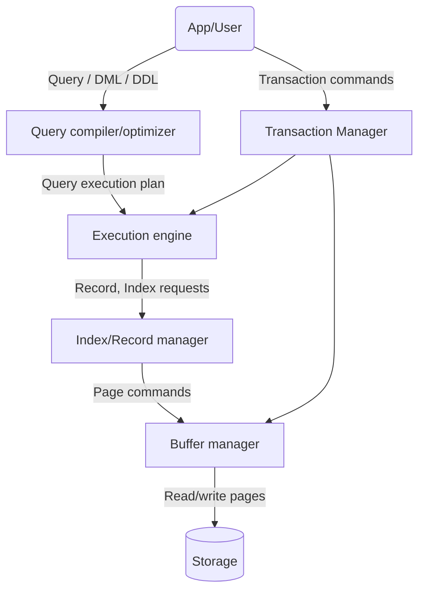

---
{"publish":true,"created":"24/12/25, 10:04","modified":"2026-03-24T15:00:17.008+02:00","tags":["Academia","Lecture","Databases"],"cssclasses":""}
---

# Index/Record manager

## Storing records
A record is saved in the external memory, in a file (e.g. one file per table), in a page/block
### Fixed-size records
The **table header** stores information about schema, number of records and more.
The **schema** defines the fields of each record, each record will have a fixed size, so it is easy to locate some specific record in the storage by using offsets
### Variable-size records
Sometimes, it is beneficial to reduce the record size to become smaller than the maximum field size, e.g. a student can have a CV up to 500MB.
Each record has a **fixed-size record header**, storing fields sizes.
Each page has a **page header**, storing record sizes.
Each table has a **table header**, storing number of records per page.
Clearly, variable-size records are more memory efficient, but are harder to locate in the storage.
## File organization
- **Heap files**
	- Always insert at the end of file
	- Deletion by marking records as `deleted`
- Sorted files
	- Sorted by **primary key** or **search key**
	- Compacted after record modifications
- Hash files
	- Page to save the record is computed using a hash function on primary key or search key
	- Pages are ~40-60% filled to prevent memory bloating (lots of empty pages) and allow for insertion (not run out of space unexpectedly)
	- This strategy can only be used with an assumption that there are no more than $k$ repetitions of a search key, because all of them must fit into one page.

Note that both Heap and Hash strategies require periodic maintenance
### Worst-case cost of operations
- B(R) - Number of pages in relation R
- B(O) - Number of pages in output

|                 | Heap file                     | Sorted file        | Hash file    |
| --------------- | ----------------------------- | ------------------ | ------------ |
| Read all        | B(R)$^{1}$                    | B(R)               | ~2B(R)       |
| Equality search | B(R)$^{1}$                    | log B(R) + B(O)    | 1            |
| Range search    | B(R)$^{1}$                    | log B(R) + B(O)    | ~2B(R)       |
| Insert record   | 2                             | *log B(R)* + 2B(R) | 2 + *~4B(R)* |
| Delete record   | *B(R)*$^{1}$ + 2 + *B(R)* + 2 | *log B(R)* + 2B(R) | 2 + *~4B(R)* |
$^{1}$ - depends on the number `deleted` records

---
## Indices
Indices are small data structures attached to relations
### Search key #definition 
A search key $k$ is a set of attributes that the index is defined on. Search key must match types, number and order of attributes in the relation.
i.e. for attributes `(date, name, isRegistered)` search key can be `k = (01.01.2003, 'Alice', False)`
### Index classification
#### Type of data entry
- A1 - The full record (with key value $k$)
	- Index contains full records and the key-based optimal structure
	- Index is also a record storage
	- Could be a sorted/hash file
	- At most one A1 index per table
	- + No need to fetch records
	- + Always consistent with data
	- - Large index files
	- - Expensive updates
- A2, A3 - `(k, RID)` or `(k, list of RIDs)`
	- RID - Record ID (in memory / on disk)
	- Index is connected to records via a "pointer"
	- A2 has fixed-size entries, A3 has variable-size entries
	- Typically much smaller than A1
	- Can define many per table
	- Requires maintenance on updates
#### Primary vs secondary
Primary index is defined on primary key
Any other index is called secondary
#### Clustered vs not clustered
In a clustered index, order of data records is the same (or close to) as order of records in the index
- Clustered index can be defined on at most one search key
- A1 implies clustered, but not vice versa
- Greatly improves performance of operations
#### Dense vs sparse
- Dense - at least one data entry per key value
- Sparse - one data entry per record page
- Sparse is smaller
- Sparse implies sorted and clustered
- A1 implies dense
#### Single vs multiple
An index can be defined on multiple attributes, and order matters(!)
#### Hash vs sorted
- Hash index
	- use hash function to find the page in the index with key $k$ (1 read)
	- Find the relevant data entry $k^{*}$ (0 reads, already in memory)
	- If not A1 - access the records via RID
- Sorted index
	- store data sorted by $k$
		- use binary search to answer range queries in logarithmic time
		- updates are linear in index size
	- store data in a balanced tree, in particular B-tree
		- updates are cheaper
		- if the degree is high, depth is low and search is cheap
### B+ trees
The most widely used index based on B-trees
Internal nodes have fanout $F: d \leq F \leq 2d$, $d$ is the tree order
- Index structure is at least 50% filled
- If there are N leaves, search requires reading $\log_{F}N$ nodes
- This is also the maximum number of nodes changed on updates
- The difference from B-tree is that leaves are sorted by key $k$ and linked into a doubly-linked list

In practice, B+ trees are typically defined as follows:
- Each node is page-sized
- $d = 100$
- 67% filled on average, meaning $F = 133$
- For the tree of height 4, $133^{4} = 312,900,700$ records capacity
- For tree of height 3, $133^{3} = 2,352,637$ records capacity
- Search and update are done in $O(1)$ I/O operations!
- Top levels can be fully stored in the buffer pool
	- Level 1 - $1$ page
	- Level 2 - $133$ pages
	- Level 3 - $17,689$ pages $\leq 133$MB
#### Search in B+ tree
Search begins from root and keys lead to the appropriate leaf (possible starting a range)
#### Insert in B+ tree
- Find correct leaf $L$
- Put data entry into $L$
	- If $L$ has enough space, we're done
	- Else, we must split $L$ into two nodes, $L, L_{2}$
		- Redistribute entries evenly, **copy up** middle key
		- Insert index entry pointing to $L_{2}$ into parent of $L$
		- This can happen recursively, in that case we **push up** middle key in internal nodes instead of copying
