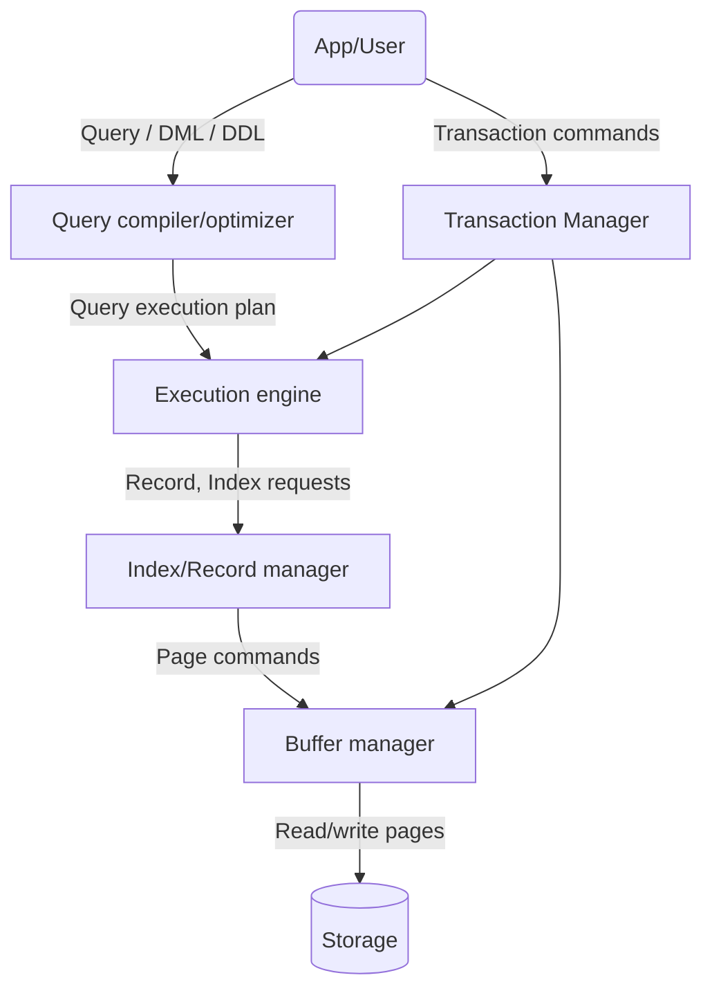

---
{"publish":true,"created":"31/12/25, 10:08","modified":"2026-02-05T11:02:01.900+02:00","tags":["Academia","Lecture","Databases"],"cssclasses":""}
---

#### Delete from B+ tree
- Find correct leaf L
- Remove data entry from L
- If L has at least $d$ entries remaining, we're done
- Else, L has exactly $d-1$ entries
	- First, check if we can borrow from adjacent siblings
	- If we can't, merge two siblings, resulting in a node with $2d-1$ entries
	- Update parent node accordingly
	- This can happen recursively, if so, we continue borrowing/merging
### Cost of using B+ tree
#### Search
In the I/O model,
- If index is in memory, search costs 0
- Otherwise,
	- One node is typically one page, reading/writing costs 1, searching inside the node is 0 once in memory
	- If one node is not a page, we count number of pages per node read/write
	- Nodes that cannot be fully loaded into memory are impractical
#### Updates
- Best/Average case - updating only one node, so 1
- Worst case - (read both siblings + merge with sibling) $\times$ (depth - 1)
	- There exists 'bad' sequences of updates where worst case delete and insert happen frequently, but these are rare in practice
---
# Execution engine

Input of the execution engine is a query plan:
- Logical tree
- Implementation choice of each node
- Scheduling, memory

Each operation is executed, its output is passed on
## Relational algebra
Relational algebra is a formal way of creating relations from other relations
There are two types of operators - Unary and Binary
We can combine operators by using a Formula (defined recursively), which is in turn equivalent to a Logical tree
- There are 5 basic operators:
	- Union: $\cup$
	- Difference: $-$
	- Selection: $\sigma$
	- Projection: $\Pi$
	- Cartesian product: $\times$
- And derived or auxiliary operators:
	- Intersection
	- Joins (natural, equi-join, theta join, ...)
	- Renaming: $\rho$
	- ...

In addition to that, there are two ways of treating relations formally - bag and set semantics
Bag semantics treat relations as multisets, so they preserve duplicates
Set semantics treat relations as sets, so they automatically eliminate any duplicates
### Union, difference and intersection
$$
\displaylines{
\text{Customers } \cup \text{ Sellers} \\
\text{Customers} - \text{Sellers} \\
\text{Customers } \cap \text{ Sellers} = \text{Customers} - (\text{Customers} - \text{Sellers}) \\
}
$$
### Selection and Projection
- Selection $\sigma_{C}(R)$ - return only rows of $R$ that fulfill the condition $C$
	- $C$ is the condition for selection, which is composed of atomic formulas with $=, <, >, \leq, \geq, <>$ and logical expressions over such formulas using $\lnot, \land, \lor$
	- e.g. $\sigma_{\text{buyer}=\text{'Alice'} \land \text{price} < 100}(\text{Purchase})$
	- Bag and set semantics are the same
- Projection $\Pi_{C}(R)$ - return only columns $C$ of $R$
	- $C$ is a subset of columns of $R$
	- e.g. $\Pi_{\text{buyer,seller}}(\text{Purchase})$
	- Set semantics may lead to less tuples in the result
### Cartesian product and joins
- Cartesian product $R \times S$ - return all pairs of tuples in relations $R, S$
- Theta join $R \Join_{\theta} S \equiv \sigma_{\theta}(R \times S)$
- Equi-join - a theta join where $\theta$ is an atomic formula in the form of $a = b$, e.g. $\text{Purchase} \Join_{\text{buyer=name}} \text{Product}$
	- Natural join - a theta join, where $\theta = \forall i: a_{i} \in R \text{ and } a_{i} \in S \implies R.a_{i} = S.a_{i}$, e.g. $\text{Purchase} \Join \text{Product}$
### Renaming
- Renaming attributes, e.g. $\rho_{A_{1}/B_{1}, \dots, A_{n}/B_{n}}(R)$ renames all $B_{i}$ to $A_{i}$
- Renaming relations, e.g. $\rho_{S}(R)$ renames relation $R$ to $S$

Operations on bags also lead to another useful operator
- Distinct (duplicate elimination) - $\delta$
---
# Executing operations
## General scheme
For the relational algebra operators, for each implementation:
- We state the necessary assumptions
	- Data is saved on external memory
	- Indices
	- Memory size
	- Data ordering and/or distribution
- Then we estimate the cost of the operation in the I/O model
	- Answers are usually up to $+2$ due to data organization
- We usually ignore the cost of writing the output
### Notations
- $B(\cdot)$ - size in pages (blocks)
- $T(\cdot)$ - number of records
- $V(\cdot, \cdot)$ - number of distinct values in the column
- $R$ - relation
- $O$ - output
- $I$ - index
#### Distinct
- Cost of the following is the cost of the full scan
	- If memory size $M$ is large enough, hold the search structure in memory (e.g. hash table), for each tuple in relation $R$ add it to the structure and output only if it wasn't seen before, write to disk when output page is full.
	- Otherwise, if data is sorted, read the relation and write only the first copy of each tuple.
- Otherwise, one can always sort the data, the cost is then the cost of sorting the data

For some operations, we can compute DISTINCT on-the-fly
#### Union, difference, intersection
- Bag union - cost of reading two relations
- Set union - cost of reading two relations + distinct
- Set difference $R - S$
	- If memory is large enough, keep $S$ in a search structure, proceed with $R$ as in set union
	- Otherwise, if data is sorted, read both relations in parallel to determine which tuples should be ignored
- Set intersection - an exercise...
#### Selection
Without an index, cost of selection is clearly $B(R)$
The cost of searching the index is
- 0 if index is in memory
- 1 for a hash index
- 2-4 read for a B+ tree index

If the index is clustered, all relevant records are adjacent, we can read them in $B(O)$
If the index is not clustered, it usually is a B+ tree, data entries are sorted, so we can read the relevant records in up to $T(O)$ if each output tuple is in a different page, the improvement is to not read the same page twice, which gives us $\min\{B(R), T(O)\}$
##### Example
Execute $\sigma_{\text{price} < 100}(\text{Purchase})$
- $B(\text{Purchase}) = 10^{5}$
- $T(\text{Purchase}) = 10^{6}$
- 50% of records fulfill the selection condition

- If there is no index on price column and the records are unordered, the cost is $B(R) = 10^{5}$
- If there is a sorted clustered index on price, size of the lowest level of $B(I)$ is 100, the cost is then index search + $B(O) \approx 2 + 0.5 \cdot B(R) = 50,002$
- If the same index is not clustered, the cost is index search + entry reading + $T(O) \approx 2 + 0.5 \cdot 100 + 0.5 \cdot T(R) = 500,052$
	- Using such an index is not helpful in the worst case
##### Reduction factor
The size of the output largely affects the cost of operations, the implementation choice can greatly benefit from knowing, or at least estimating this size
The DBMS keeps statistics about the values of columns/indices
Assuming values of some column are uniformly distributed, for $\sigma_{A=x}(R)$, $B(O) \approx \frac{B(R)}{V(R, A)}$, similarly $T(O) \approx \frac{T(R)}{V(R, A)}$
What can we do about $\sigma_{A=B}(R)$ ? We will see this in equi-joins
For $\sigma_{A < x}(R)$, we assume $A_{\min}, A_{\max}$ are known, then $B(O) \approx B(R) \cdot \frac{x-A_{\min}}{A_{\max}-A_{\min}}$

The reduction factor is determined by the operation and statistics available
The same factor is used to compute the relevant fraction of relation pages, relation tuples and data entries in the index
#### Projection
- Bag projection - simply cost of the full scan
- Set projection - cost projection + distinct
	- If using a search structure, keep only the remaining fields, cost of projection is then included in that of distinct

Using an index
- If index contains projected attributes and is dense - no need to read records at all, cost is the size of the index in pages, $B(I)$
## Executing joins
### Implementing cartesian product
A naive implementation is a nested loop, for each record in $R$, read all records in $S$ and write all pairs, cost is then $B(R) + B(R) \cdot B(S)$
It is clear then, that the outside loop should be run over a smaller relation, here we assumed $B(R) \leq B(S)$
A nested loop join is then identical, except that only pages that match condition $\theta$ are written to the output
A key observation here is that we don't use the most of available main memory, which leads to the following idea
### Block nested loop join
Instead of reading one page at a time, we can read $M-2$ pages from $R$ at once and then compare each page of $S$ to these pages
The cost then becomes $B(R) + \frac{B(R)}{M-2} \cdot B(S)$
A key observation here is that the size of a join is usually much smaller than that of a cartesian product, maybe we can find relevant pairs faster? How?
### Index nested loop join
Use an index to fetch only relevant pairs
Assume there is an index on $S.B$ (column $B$ in $S$) and we want to compute $R \Join_{R.A = S.B} S$
For each tuple of $R$, we find matching tuples of $S$ using the index, read them and write pairs
The cost is then reading $R$ + search per tuple of $R$
If index is clustered, the cost is
$$
\displaylines{
B(R) + T(R) \cdot \lrp{\text{Index search} + RF_{R} \cdot \frac{B(S)}{V(S, B)}} \\
\text{Where } RF_{R} \text{ is the reduction factor of } R \\
\text{It is a fraction of tuples of } R \text{ that have a matching tuple of } S \\
\implies RF_{R} = \min\lrc{1, \frac{V(S, B)}{V(R, A)}} \\
}
$$
If index is not clustered, the cost is
$$
\displaylines{
B(R) + T(R) \cdot \lrp{\text{Index search} + RF_{R} \cdot \lrp{\text{Entry reading} + \frac{T(S)}{V(S, B)}}} \\
}
$$
Possible improvements are reading pages of $S$ per page of $R$ instead of "per tuple" and a block index nested loop join
### Sort-merge join
If $R$ and $S$ are sorted by relevant columns, finding matches for an equi-join is easy, similar to merge in external merge sort
Execution of $R \Join_{R.A=S.B} S$
- Read a page from $R$ and from $S$
- Output all the matches
- If the last $A$ is smaller than last $B$, read a page of $R$, otherwise read a page of $S$
- Continue until reaching the end of $R$ or $S$
Cost of a Sort-Merge join is then the cost of sorting + cost of merge
We assume the cost of merge to be $B(R) + B(S)$, then the total cost is
$(2k+1)(B(R) + B(S))$ where $k$ is the number of passes in the sort, which is usually 2
We can pass the outputs of the last sorting pass directly to the merging, saving one read + write of $R$ and $S$, depending on available memory. This is called pipelining
### Hash join
First, partition both $R$ and $S$ using a hash function $h_{1}$. Clearly, tuples in $R_{i}$ can only match tuples in $S_{i}$
Here, in order to be able to do this in one pass, meaning that each page is read only once, there can be no more than $M-1$ partitions.
Then, for each partition $R_{i}$, for each page in $S_{i}$ write matching pairs. This step assumes $\forall i: B(R_{i}) < M-2$. If this is not fulfilled, partition larger partitions again!
The cost of a hash join (assuming one partition step) is just $3(B(R) + B(S))$

The only limitation is that $B(R), B(S) \leq (M-1)(M-2)$, which is usually the case
- 1MB memory - up to 256MB data
- 2MB memory - up to 1GB data
- 4MB memory - up to 4GB data
- 32MB memory - up to 256GB data

| Algorithm              | Assumptions                                    | Advantages                                                                                     |
| ---------------------- | ---------------------------------------------- | ---------------------------------------------------------------------------------------------- |
| Nested loop join       | No assumptions                                 | Naive, efficient if one relation is very small or the result is close to Cartesian product     |
| Block nested loop join | No assumptions                                 | Better than nested loop join                                                                   |
| Index nested loop join | Index on one relation                          | Usually better than nested loop if index is clustered or there are few matches per tuple |
| Sort-merge join        | Each tuple has relatively few matches          | Very efficient if data is sorted, result is sorted, usually more efficient than loops (linear) |
| Hash join              | Data can be split into small enough partitions | Usually the most efficient (linear)                                                            |
