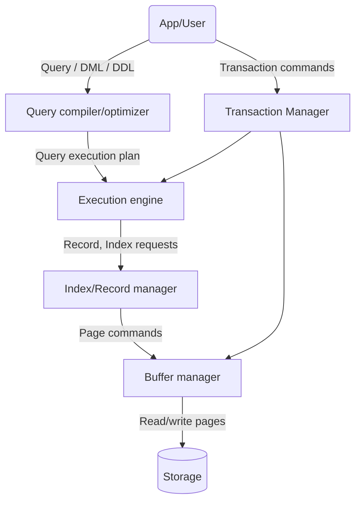
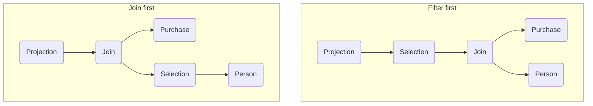

---
{"publish":true,"created":"14/01/26, 09:45","modified":"2026-02-02T19:25:00.117+02:00","tags":["Academia","Lecture","Databases"],"cssclasses":""}
---

# Query complier/optimizer

First, a query is converted to a query plan (tree), e.g.
```mysql
SELECT buyer
FROM   Purchase, Person
WHERE  buyer=name
       AND city = 'Seattle'
       AND phone > '5430000'
```
This query can be converted into two query plans

Which plan is more efficient? Join is an expensive operation, so it is best to reduce the size of operands as much as possible! Filter first IS the better one.
## Transformations in relational algebra
### Algebraic laws: Union, Intersection, Join
#### Commutativity and Associativity
- $R \cup S = S \cup R, R \cup (S \cup T) = (R \cup S) \cup T$
- $R \cap S = S \cap R, R \cap (S \cap T) = (R \cap S) \cap T$
- $R \Join S = S \Join R, R \Join (S \Join T) = (R \Join S) \Join T$ - this applies to both bag and set semantics

Note that each transformation yields a different operation order.
#### Distributivity
- The usual for $\cup, \cap$
- $R \Join (S \cup T) = (R \Join S) \cup (R \Join T)$
### Algebraic laws: Selection
- $\sigma_{C \land C'}(R) = \sigma_{C}(\sigma_{C'}(R)) = \sigma_{C}(R) \cap \sigma_{C'}(R)$
- $\sigma_{C \lor C'}(R) = \sigma_{C}(R) \cup \sigma_{C'}(R)$
- When $C$ is defined on attributes from $R$ only
	- $\sigma_{C}(R \Join S) = \sigma_{C}(R) \Join S$
- $\sigma_{C}(R - S) = \sigma_{C}(R) - S$
- $\sigma_{C}(R \cup S) = \sigma_{C}(R) \cup \sigma_{C}(S)$
- $\sigma_{C}(R \cap S) = \sigma_{C}(R) \cap S$
### Selection everywhere
First rule of thumb - perform selection as soon as possible and wherever possible
- Smaller input to subsequent operations
- "Free" - can be done on tuples already in memory anyway

BUT!
- Selection may not help if the next operation could use an index

### Selection movearound
Let there be the following views and query:
```mysql
CREATE VIEW adults AS
SELECT persName, age
FROM   Person
WHERE  Person.age >= 18
       AND persName NOT LIKE '%secret%';

# ------------------------------------

CREATE VIEW retailPerson AS
SELECT buyer AS retailPerson, product
FROM   Purchase
	UNION
SELECT seller AS retailPerson, product
FROM   Purchase;

# ------------------------------------

SELECT *
FROM   adults, retailPeople
WHERE  persName = retailPerson
       AND product = 'iPud23';
```
This can be optimized by moving selection from one query to another!
First, we move criterion on `product` to `retailPerson`
```mysql
CREATE VIEW retailPerson AS
SELECT buyer AS retailPerson, product
FROM   Purchase
WHERE  product = 'iPud23'
	UNION
SELECT seller AS retailPerson, product
FROM   Purchase
WHERE  product = 'iPud23';

# ------------------------------------

SELECT *
FROM   adults, retailPeople
WHERE  persName = retailPerson;
```
And then optimized again, an intermediate step
We can move criterion on `persName` to the main query
```mysql
CREATE VIEW adults AS
SELECT persName, age
FROM   Person
WHERE  Person.age >= 18;

# ------------------------------------

SELECT *
FROM   adults, retailPeople
WHERE  persName = retailPerson
	   AND persName NOT LIKE '%secret%';
```
And final optimization
We move criterion on `persName` to both `adults` and `retailPerson`
```mysql
CREATE VIEW adults AS
SELECT persName, age
FROM   Person
WHERE  Person.age >= 18
	   AND persName NOT LIKE '%secret%';

# ------------------------------------

CREATE VIEW retailPerson AS
SELECT buyer AS retailPerson, product
FROM   Purchase
WHERE  product = 'iPud23'
	   AND persName NOT LIKE '%secret%'
	UNION
SELECT seller AS retailPerson, product
FROM   Purchase
WHERE  product = 'iPud23'
	   AND persName NOT LIKE '%secret%';

# ------------------------------------

SELECT *
FROM   adults, retailPeople
WHERE  persName = retailPerson;
```
The resulting query has a MUCH smaller join, which is significantly cheaper
### Selection and HAVING
Let there be a query
```mysql
SELECT    product, MAX(age)
FROM      Person, Purchase
WHERE     persName = buyer
GFROUP BY product
HAVING    MAX(age) > 40
```
Can we somehow optimize it?
We only return the maximum age of a buyer per product. This age will always be larger than 40. This means that tuples with $age \leq 40$ do not affect the result!
```mysql
SELECT    product, MAX(age)
FROM      Person, Purchase
WHERE     persName = buyer
		  AND age > 40
GFROUP BY product
```
Is this always possible? Definitely not! For example if we take `MIN` instead of `MAX`, tuples with $age \leq 40$ do affect the result
### Algebraic laws: Projection
- $\Pi_{M}(R \Join_{\theta} S) = \Pi_{N}(\Pi_{P}(R) \Join_{\theta} \Pi_{Q}(S))$
	- where $N, P, Q$ are appropriate subsets of attributes of $M$
- $\Pi_{M}(\Pi_{N}(R)) = \Pi_{M \cap N}(R)$
### Projection everywhere
Second rule of thumb - perform bag projection as soon as possible and wherever possible
- Smaller input to subsequent operations
- "Free" - can be done on tuples already in memory anyway

BUT!
- Make sure that columns that are projected out are not needed later
- Projection may not help if the next operation could use an index
### Unnesting queries
Let there be a query
```mysql
SELECT DISTINCT product
FROM   Purchase
WHERE  buyer IN (SELECT persName
				 FROM   Person
				 WHERE  age >= 18)         
```
This can be unnested!
```mysql
SELECT DISTINCT product
FROM   Purchase, Person
WHERE  buyer=persName
       AND age >= 18
```

Another example:
```mysql
SELECT DISTINCT x.name, x.maker
FROM   Product x
WHERE  x.color = 'blue'
       AND x.price >= ALL (SELECT y.price
                           FROM   Product y
						   WHERE x.maker = y.maker
						   AND y.color = 'blue')
```
What can we done? We can compute the complement first
```mysql
SELECT DISTINCT x.name, x.maker
FROM   Product x
WHERE  x.color = 'blue'
       AND x.price < ANY (SELECT y.price
                           FROM   Product y
						   WHERE x.maker = y.maker
						   AND y.color='blue')
```
And this can now be unnested
```mysql
SELECT DISTINCT x.name, x.maker
FROM   Product x, Product y
WHERE  x.color = 'blue'
       AND x.price < y.price
       AND x.maker = y.maker
       AND y.color = 'blue'
```
And now take the complement of this
```mysql
SELECT DISTINCT x.name, x.maker
FROM   Product x
WHERE  x.color = 'blue'
	EXCEPT
SELECT x.name, x.maker
FROM   Product x, Product y
WHERE  x.color = 'blue'
       AND x.price < y.price
       AND x.maker = y.maker
       AND y.color = 'blue'
```
---
## Pipelining and plan cost estimation
### Computing the cost of a plan
We need to sum the costs of the plan operations
- Some operations may be cheaper with other operations
	- We saw for example projection + distinct, cartesian product + selection
	- The output of previous operation may be sorted
- The cost depends on the input size
	- size of input relations is known
	- we need to compute output size of previous operation
### Pipelining
The idea is simple - pass each output tuple of one operation directly to the next operation (in the main memory)
We save 1 write of current operation output and 1 read of next operation input
There is, of course, a condition - sufficient memory. If we use entire $M$ pages in memory for sorting by name, we cannot pipeline to sorting by GPA

An example of pipelining for this query:
```mysql
SELECT product
FROM   Purchase, Person
WHERE  Person.persName = Purchase.buyer
	   AND Person.age >= 18
```
Let the query plan be:
- $\sigma_{\text{age} \geq 18}(\text{Person})$
- $\sigma_{\text{age} \geq 18}(\text{Person}) \Join_{\text{persName}=\text{buyer}} \text{Purchase}$
- $\Pi_{\text{product}}(\sigma_{\text{age} \geq 18}(\text{Person}) \Join_{\text{persName}=\text{buyer}} \text{Purchase})$
The pipeline would then look something like this:
- Selection (without writing output to the disk)
- Hash join step 1 for Person (with writing output to the disk)
- Hash join step 1 for Purchase (with writing output to the disk)
- Hash join step 2 (without writing output to the disk)
- Projection (with writing output somewhere)

We saved 1 write + read of selection result and 1 write + read of join result!
### Computing output size
#### Cartesian product
- Input: $R, S$
- Output number of tuples: $T(R) \cdot T(S)$
- Output tuple size: $\frac{B(R)}{T(R)} + \frac{B(S)}{T(S)}$
- Output number of pages: $B(R)T(S) + B(S)T(R)$
#### Reduction factor
- $\frac{1}{V(R, A)}$ - when selecting one value out of $V(R, A)$ values in column $R(A)$
	- this is correct under the assumption of a uniform distribution
- $\frac{x-y}{A_{\max}-A_{\min}}$ - when selecting a range between $y$ and $x$ when the values in the column range from $A_{\min}$ to $A_{\max}$
	- this is correct under the assumption of uniform distribution of values between $A_{\min}$ and $A_{\max}$
- $\frac{1}{\max\lrc{V(R, A), V(S, B)}}$ - for the join $R \Join_{A=B} S$
	- this is correct under the assumption of uniform distribution in $A$ and in $B$
### Cost of operations

| Operation  | Without index | Clustered index                            | Non-clustered index                                                        | Pipelined |
| ---------- | ------------- | ------------------------------------------ | -------------------------------------------------------------------------- | --------- |
| Selection  | B(input)      | Index search$^{[1]}$ + B(input) $\cdot$ RF | Index search$^{[1]}$ (+ B(index) $\cdot$ RF$^{[2]}$) + T(input) $\cdot$ RF | 0         |
| Projection | B(input)      | B(index)$^{[3]}$                           | B(index)$^{[3]}$                                                           | 0         |
1. 0 if in memory, 1 for hash index, 2-4 for sorted index
2. only relevant to sorted non-clustered index not in memory
3. assuming the index is dense and contains the projected fields

| Operation              | Without index                                      | Clustered index on S                                     | Non-clustered index on S                   | R is pipelined                                                                          |
| ---------------------- | -------------------------------------------------- | -------------------------------------------------------- | ------------------------------------------ | --------------------------------------------------------------------------------------- |
| Nested loop join       | B(R) + B(R)$\cdot$B(S)                             | -                                                        | -                                          | B(R)$\cdot$B(S)                                                                         |
| Block nested loop join | B(R) + $\frac{B(R) \cdot B(S)}{M-2}$               | -                                                        | -                                          | $\frac{B(R)\cdot B(S)}{M-2}$                                                            |
| Index nested loop join | -                                                  | B(R) + T(R)$\cdot$(selection on S$^{[3]}$)               | B(R) + T(R)$\cdot$(selection on S$^{[3]}$) | T(R)$\cdot$(B(R) + T(R)$\cdot$(selection on S)                                          |
| Sort-merge join        | (2$\cdot \#$of passes+1)$^{[1]}$$\cdot$(B(R)+B(S)) | B(S)$^{[2]}$+(2$\cdot \#$of passes+1)$^{[1]}$$\cdot$B(R) | -                                          | (2$\cdot \#$of passes)$^{[1]}$$\cdot$B(R) + (2$\cdot \#$of passes+1)$^{[1]}$$\cdot$B(S) |
| Hash join              | 3(B(R)+B(S))                                       | -                                                        | -                                          | 2B(R)+3B(S)                                                                             |
1. assuming no pipelining from sorting to merge
2. sorted index
3. but including a reduction factor for tuples that have a match in S
#### Example
- $R_{1}$(<u>A</u>, B, C)
- $R_{2}$(<u>D</u>, E)
- $R_{3}$(<u>F</u>, G)
- $P = (\sigma_{C=0}(R_{1})) \Join_{B=E} (R_{2} \Join_{E=G} R_{3})$

Assumptions:
- Hash join is possible
- Sort-merge join can always be done in 2 passes, the result is written to disk
- The indices are in the main memory
- Output is pipelined except for sorting output

Both joins are hash joins
- Selection cost is $B(R_{1})$, output size is $\frac{B(R_{1})}{V(R_{1}, C)}$
- Cost of join on $E=G$ is $3(B(R_{2})+B(R_{3}))$, output size is $\frac{B(R_{2}) \cdot T(R_{3}) + B(R_{3}) \cdot T(R_{2})}{\max\lrc{V(R_{2}, E), V(R_{3}, G)}}$
- Cost of join on $B=E$ is 2(selection output size) + 0
	- previous results are pipelines, saves one full read
	- join output is already partitioned by hash

Total cost is $B(R_{1}) + 3(B(R_{2})+B(R_{3})) + 2\frac{B(R_{1})}{V(R_{1}, C)}$

Sorted clustered index on C, first join is a hash join, second join is sort merge join
- Selection cost is $0+\frac{B(R_{1})}{V(R_{1}, C)}$, output size is $\frac{B(R_{1})}{V(R_{1}, C)}$
- Cost of join on $E = G$ is $3(B(R_{2}) + B(R_{3}))$, output size is $\frac{B(R_{2}) \cdot T(R_{3}) + B(R_{3}) \cdot T(R_{2})}{\max\lrc{V(R_{2}, E), V(R_{3}, G)}}$
- Cost of join on $B = E$ is $4(\text{selection output size} + \text{join output size})$
	- previous results are pipelined

Total cost is $\frac{B(R_{1})}{V(R_{1}, C)} + 3(B(R_{2}) + B(R_{3})) + 4\lrp{\frac{B(R_{1})}{V(R_{1}, C)} + \frac{B(R_{2}) \cdot T(R_{3}) + B(R_{3}) \cdot T(R_{2})}{\max\lrc{V(R_{2}, E), V(R_{3}, G)}}}$

Sorted clustered index on $E$ and on $G$, joins are sort-merge
- Selection cost is $B(R_{1})$, output size is $\frac{B(R_{1})}{V(R_{1}, C)}$
- Cost of join on $E = G$ is $B(R_{2}) + B(R_{3})$, output size is $\frac{B(R_{2}) \cdot T(R_{3}) + B(R_{3}) \cdot T(R_{2})}{\max\lrc{V(R_{2}, E), V(R_{3}, G)}}$
- Cost of join $B = E$ is $4(\text{selection output size}) + 0$
	- selection result is pipelined
	- previous join is pipelined and sorted by $E$

Total cost is $B(R_{1}) + B(R_{2}) + B(R_{3}) + \frac{4B(R_{1})}{V(R_{1}, C)}$
