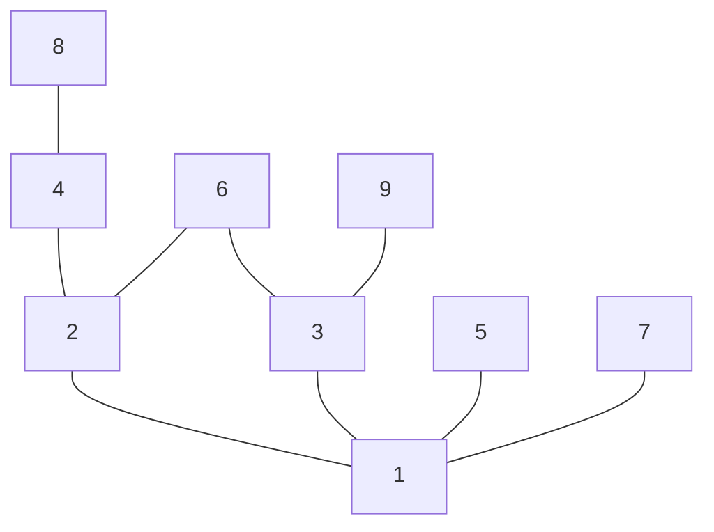

---
{"publish":true,"created":"03/12/24, 14:12","modified":"2025-11-21T21:10:14.026+02:00","tags":["Academia","Lecture","Discrete-math"],"cssclasses":""}
---

# Discrete-math 10
## Ordering relations
$$
\displaylines{
\text{Let } (A, \preccurlyeq) \text{ be a partially ordered set} \\
}
$$
## Smallest element #definition 
$$
\displaylines{
a \text{ is called the smallest element of } A \text{ iff } \\
\forall b \in A: a \preccurlyeq b \\
\text{Sometimes the smallest element is called minimum of the set} \\
}
$$
---
## Minimal element #definition 
$$
\displaylines{
a \in A \text{ is called a minimal element of } A \text{ iff } \\
\lnot (\exists b \in A: b \neq a \land b \preccurlyeq a) \\
\equiv \forall b \in A: b = a \lor \lnot(b \preccurlyeq a) \\
\equiv \forall b \in A: (b \preccurlyeq a) \to (b = a) \\
}
$$
---
## Greatest element #definition 
$$
\displaylines{
a \text{ is called the greatest element of } A \text{ iff } \\
\forall b \in A: b \preccurlyeq a \\
\text{Sometimes the biggest element is called maximum of the set} \\
}
$$
---
## Maximal element #definition 
$$
\displaylines{
a \in A \text{ is called a maximal element of } A \text{ iff } \\
\lnot (\exists b \in A: b \neq a \land a \preccurlyeq b) \\
\equiv \forall b \in A: b = a \lor \lnot(a \preccurlyeq b) \\
\equiv \forall b \in A: (a \preccurlyeq b) \to (b = a) \\
}
$$
---
## Hasse diagram for divisibility

---
## Partial order properties #theorem 
$$
\displaylines{
& \text{Let } (A, \preccurlyeq) \text{ be a partially ordered set} \\
1. & \text{If } A \text{ has a smallest element, then it is unique} \\
2. & \text{If } A \text{ has a smallest element, then it is minimal and the only minimal element of the set} \\
3. & \text{If in addition, } (A, \preccurlyeq) \text{ is a totally ordered set and } a \text{ is a minimal element,} \\
& \text{then } a \text{ is also the smallest} \\
}
$$
$$
\displaylines{
\text{Proof for 1.} \\
\text{Let } a = min(A), b = min(A) \\
a = min(A) \land b \in A \implies a \preccurlyeq b \\
b = min(A) \land a \in A \implies b \preccurlyeq a \\
a \preccurlyeq b \land b \preccurlyeq a \underset{ \text{By anti-symmetry of ordering relation} }{ \implies } a = b \\
\implies \boxed{\exists! a \in A: a = min(A)} \\
}
$$
$$
\displaylines{
\text{Proof for 2.} \\
\text{Let } a = min(A), b \in A : b \preccurlyeq a \\
a = min(A) \implies a \preccurlyeq b \\
a \preccurlyeq b \land b \preccurlyeq a \implies a = b \implies \forall b \in A: (b \preccurlyeq a) \to (b = a) \\ \implies \boxed{a \text{ is a minimal element}} \\
\text{Let } c \in A, \text{such that } c \text{ is a minimal element} \\
a = min(A) \implies a \preccurlyeq c \\
c \text{ is minimal} \implies \forall x \in A: (x \preccurlyeq c) \to x = c \\
a \preccurlyeq c \implies a = c \implies \boxed{a \text{ is the only minimal element}} \\
}
$$
$$
\displaylines{
\text{Proof for 3.} \\
\text{Proof in lecture 11} \\
}
$$
---
