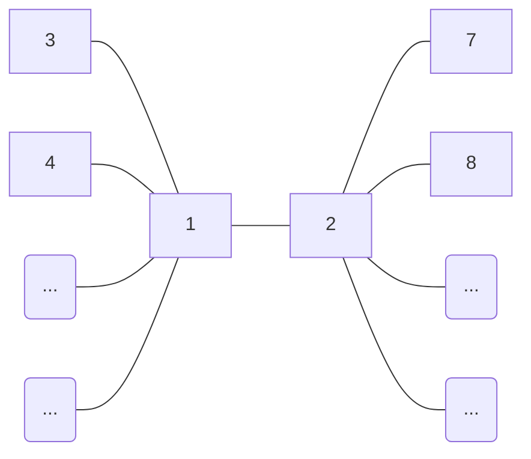

---
{"publish":true,"created":"12/02/25, 12:02","modified":"2025-11-21T21:10:14.082+02:00","tags":["Academia","Lecture","Discrete-math"],"cssclasses":""}
---

# 1b
$$
\displaylines{
\text{Prove: } \forall n \text{ even} \in \mathbb{N}: \exists \text{ tree } G = (V, E): \forall v \in V: deg(v) \in \Set{ 1, \frac{n}{2} } \\
\\
\text{Proof:} \\
\text{Let us build such a graph} \\
\text{Let } n \in \mathbb{N} \text{ be even} \\
\text{Let two vertices have an edge between them} \\
\text{Let's call these vertices } u, v \\
\text{Now let us add } \frac{n-2}{2} \text{ vertices to } \Gamma(v) \\
\implies deg(v) = \frac{n-2}{2} + 1 = \frac{n}{2} \\
\text{Now let us add another } \frac{n-2}{2} \text{ vertices to } \Gamma(u) \\
\implies deg(u) = \frac{n-2}{2} + 1 = \frac{n}{2} \\
\text{Degrees of all vertices except } u, v \text{ are } 1 \\
deg(u) = deg(v) = \frac{n}{2} \\
\text{There are no cycles and the graph is connected} \implies G \text{ is a tree} \\
}
$$

# 2a
$$
\displaylines{
\text{Let } f: A \to B \\
\text{Prove or disprove: } \forall X, Y \subseteq A: f[X \setminus Y] = f[X] \setminus f[Y] \\
\\
\text{Disproof:} \\
\text{Let } 1 \in B \\
\text{Let } f(x) = 1 \\
\text{Let } X \neq Y \\
f[\underbrace{ X \setminus Y }_{ \neq \emptyset }] = \Set{ 1 } \\
f[X] \setminus f[Y] = \Set{ 1 } \setminus \Set{ 1 } = \emptyset \\
}
$$
# 2b
$$
\displaylines{
\text{Prove or disprove: } \forall A, B, C: A \setminus (B \cap C) = (A \setminus B) \cup (A \setminus C) \\
\\
\text{Disproof:} \\
\text{Left: } x \in A, x \not\in (B \cap C) \implies x \in A \land (x \not\in B \lor x \not\in C) \\
\text{Right: } (x \in A \land x \not\in B) \lor (x \in A \land x \not\in C) = x \in A \land (x \not\in B \lor x \not\in C) \\
\implies A \setminus (B \cap C) = (A \setminus B) \cup (A \setminus C) \\
}
$$
# 2c
$$
\displaylines{
\text{Let } A \text{ be a set} \\
\text{Let } R \text{ be a relation on } A \\
\text{Let } S \text{ be a relation on } A \\
S = \Set{ (a, b) \in A \times A | \forall c \in A: (a, c) \in R \implies (c, b) \in R } \\
\text{Prove or disprove: } R \text{ is an equivalence relation} \implies R = S \\
\text{Disproof:} \\
A = \Set{ 1, 2, 3 } \\
R = I_{A} \\
S = I_{A} \cup \Set{ (1, 2), (1, 3), (2, 1), (2, 3), (3, 1), (3, 2) } \\
}
$$
# 5
$$
\displaylines{
\text{Let } X \text{ be a set} \\
T \subseteq P(X) \text{ is called symmetric-complement if} \\
1. \quad T \neq \emptyset \\
2. \quad \forall A, B \in T: A \triangle B \in T \\
3. \quad \forall A \in T: A^{c} \in T \\
}
$$
## 5a
$$
\displaylines{
\text{Let } X \text{ be a set} \\
\text{Let } T \subseteq P(X) \text{ be a symmetric-complement} \\
\text{Is } \emptyset \in T? \\
\\
\text{Solution:} \\
\forall A \in T: \emptyset = A \triangle A \in T \\
}
$$
## 5b
$$
\displaylines{
\text{Let } X \text{ be a set} \\
\text{Let } T, S \subseteq P(X) \text{ be a symmetric-complements} \\
\text{Prove: } T \cap S \text{ is a symmetric-complement} \\
\\
\text{Proof:} \\
\emptyset \in T, \emptyset \in S \implies \emptyset \in T \cap S \implies \boxed{ T \cap S \neq \emptyset } \\
\text{Let } A, B \in T \cap S \\
\implies A, B \in T \implies A \triangle B \in T \\
\implies A, B \in S \implies A \triangle B \in S \\
\implies \boxed{ A \triangle B \in T \cap S } \\
A \in T \implies A^{c} \in T \\
A \in S \implies A^{c} \in S \\
\implies \boxed{ A^{c} \in T \cap S } \\
}
$$
## 5c
$$
\displaylines{
\text{Let } X \text{ be a set} \\
\text{Let } T, S \subseteq P(X) \text{ be a symmetric-complements} \\
\text{Prove: } T \cup S \text{ is a symmetric-complement} \iff T \subseteq S \lor S \subseteq T \\
\\
\text{Proof:} \\
\text{Let } T \subseteq S \text{ (WLOG)} \\
\implies T \cup S = S \implies \boxed{ T \cup S \text{ is a symmetric-complement} } \\
\text{Let } T \cup S \text{ be a symmetric-complement} \\
\text{Let } A \in T \setminus S, B \in S \setminus T \\
A, B \in T \cup S \\
\text{Let } A \triangle B \in S \\
\implies (A \triangle B) \triangle B \in S \implies A \in S - \text{Contradiction!} \implies A \triangle B \not\in S \\
\implies A \triangle B \in T \\
\implies A \triangle (A \triangle B) \in T \implies B \in T - \text{Contradiction!} \implies A \triangle B \not\in T \\
\implies A \triangle B \not\in T \cup S - \text{Contradiction!} \\
\implies T \setminus S = \emptyset \lor S \setminus T = \emptyset \\
\implies \boxed{ T \subseteq S \lor S \subseteq T } \\
}
$$
