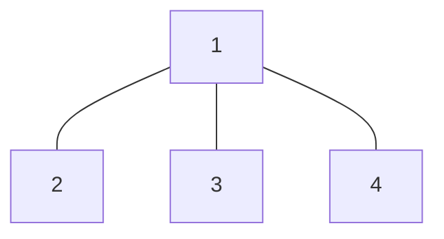

---
{"publish":true,"created":"09/02/25, 13:02","modified":"2025-11-21T21:10:14.086+02:00","tags":["Academia","Lecture","Discrete-math"],"cssclasses":""}
---

# 1a
$$
\displaylines{
\dots
}
$$
# 1b
$$
\displaylines{
\text{Let } n \geq 4 \text{ be an even number} \\
\text{Prove by induction: } \exists \text{ tree } T = (V, E): \lvert V \rvert = n : \forall v \in V: deg(v) \in \Set{ 1, 3 } \\
\\
\text{Proof:} \\
\text{Base case. Let } n = 4 \\
}
$$

$$
\displaylines{
\text{Induction step. Let the statement hold for } n \\
\text{Let } G = (V, E) \text{ be a tree with } n \text{ vertices} \\
\text{Let } \forall v \in V: deg(v) \in \Set{ 1, 3 } \\
G \text{ is a tree} \implies \exists v \in V: deg(v) = 1 \\
\text{Let } u, w \not\in V \\
\text{Let } G' = (V \cup \Set{ u, w }, E \cup \Set{ \Set{ v, u }, \Set{ v, w } }) \\
deg(v) = 3 \text{ in } G' \\
deg(u) = deg(w) = 1 \text{ in } G' \\
\implies \forall v \in V \cup \Set{ u, w }: deg(v) \in \Set{ 1, 3 } \\
G' \text{ has } n + 2 \text{ vertices} \\
\implies \boxed{ \text{Proved by Induction} } \\
}
$$
---
# 2a
$$
\displaylines{
\text{Prove or disprove: } R, S \text{ are equivalence relations on } A \\ \implies R \triangle S \text{ is an equivalence relation on } A \\
\\
\text{Disproof:} \\
\forall a \in A: (a, a) \in R, (a, a) \in S \implies (a, a) \not\in R \triangle S \\
\implies R \triangle S \text{ is not reflexive} \implies \boxed{ R \triangle S \text{ is not an equivalence relation} } \\
}
$$
# 2b
$$
\displaylines{
\text{Let } f: X \to Y \\
\text{Let } D, C \subseteq Y \\
\text{Prove or disprove: } f^{-1}[C \cap D] = f^{-1}[C] \cap f^{-1}[D] \\
\\
\text{Proof:} \\
x \in f^{-1}[C \cap D] \iff \exists y \in C \cap D: f(x) = y \iff y \in C \land y \in D \\
\iff x \in f^{-1}[C] \land x \in f^{-1}[D] \iff x \in f^{-1}[C] \cap f^{-1}[D] \\
\implies \boxed{ f^{-1}[C \cap D] = f^{-1}[C] \cap f^{-1}[D] } \\
}
$$
---
# 3
$$
\displaylines{
\text{Let } A \text{ be a set such that } \lvert A \rvert \geq 2 \\
\text{Let } f: A \times P(A) \to P(P(A)), f(x, B) = \Set{ D \subseteq B | x \in D } \\
}
$$
## 3a
$$
\displaylines{
\text{Prove: } f \text{ is not injective} \\
\\
\text{Proof:} \\
\lvert A \rvert \geq 2 \implies \exists a \neq b \in A \\
\text{Let } a \neq b \in A \\
a \neq b \implies (a, \emptyset) \neq (b, \emptyset) \\
f(a, \emptyset) = f(b, \emptyset) = \emptyset \\
\implies \boxed{ f \text{ is not injective} } \\
}
$$
## 3b
$$
\displaylines{
\text{Prove: } \forall x \in A: \forall B_{1}, B_{2} \in P(A): f(x, B_{1} \cap B_{2}) = f(x, B_{1}) \cap f(x, B_{2}) \\
\\
\text{Proof:} \\
\text{Let } x \in A \\
\text{Let } B_{1}, B_{2} \in P(A) \\
f(x, B_{1} \cap B_{2}) = \Set{ D \subseteq B_{1} \cap B_{2} | x \in D } \\
f(x, B_{1}) \cap f(x, B_{2}) = \Set{ D \subseteq B_{1} | x \in D } \cap \Set{ D \subseteq B_{2} | x \in D } \\
\text{Let } x \not\in B_{1} \cap B_{2} \\
\implies x \not\in B_{1} \text{ (symmetric, WLOG)} \\
\implies f(x, B_{1} \cap B_{2}) = \emptyset \text{ and } f(x, B_{1}) = \emptyset \\
\implies f(x, B_{1} \cap B_{2}) = f(x, B_{1}) \cap f(x, B_{2}) = \emptyset \\
\text{Let } x \in B_{1} \cap B_{2} \\
\text{Let } C \in f(x, B_{1} \cap B_{2}) \\
\implies x \in C \land C \subseteq B_{1} \cap B_{2} \implies C \subseteq B_{1} \land C \subseteq B_{2} \\
\implies C \in f(x, B_{1}) \land C \in f(x, B_{2}) \implies C \in f(x, B_{1}) \cap f(x, B_{2}) \\
\implies \boxed{ f(x, B_{1} \cap B_{2}) \subseteq f(x, B_{1}) \cap f(x, B_{2}) } \\
\text{Let } C \in f(x, B_{1}) \cap f(x, B_{2}) \\
\implies x \in C \land C \subseteq B_{1} \land C \subseteq B_{2} \implies C \subseteq B_{1} \cap B_{2} \implies C \in f(x, B_{1} \cap B_{2}) \\
\implies \boxed{ f(x, B_{1}) \cap f(x, B_{2}) \subseteq f(x, B_{1} \cap B_{2}) } \\
\implies \boxed{ f(x, B_{1} \cap B_{2}) = f(x, B_{1}) \cap f(x, B_{2}) } \\
}
$$
## 3c
$$
\displaylines{
\text{Prove: } \exists x \in A, B_{1}, B_{2} \in P(A): f(x, B_{1} \cup B_{2}) \neq f(x, B_{1}) \cup f(x, B_{2}) \\
\\
\text{Proof:} \\
\lvert A \rvert \geq 2 \implies \Set{ a, b } \subseteq A \\
\text{Let } x = a \\
\text{Let } B_{1} = \Set{ a }, B_{2} = \Set{ b } \\
f(x, B_{1} \cup B_{2}) = f(x, \Set{ a, b }) = \Set{ \Set{ a }, \Set{ a, b } } \\
f(x, B_{1}) \cup f(x, B_{2}) = \Set{ \Set{ a } } \cup \emptyset = \Set{ \Set{ a } } \\
\implies \boxed{ f(x, B_{1} \cup B_{2}) \neq f(x, B_{1}) \cup f(x, B_{2}) } \\
}
$$
---
# 4a
$$
\displaylines{
\text{There are 30 students and two buses (red, green) with 15 places} \\
\text{How many ways are there to split 30 students into two groups of 15?} \\
\\
\text{Solution:} \\
\text{No order, no repetition, buses are distinct} \\
\implies \binom{30}{15} \\
}
$$
# 4b
$$
\displaylines{
\text{How many ways are there to seat 30 students in a 50-place bus with numbered seats?} \\
\\
\text{Solution:} \\
\text{Let us first choose 30 places} \\
\text{And then arrange children in them, as places are distinct} \\
\implies \binom{50}{30} \cdot 30! = \frac{50!}{30!20!} \cdot 30! = \frac{50!}{20!} \\
}
$$
# 4c
$$
\displaylines{
\text{Teacher wants to assign one of the two tasks to some students} \\
\text{No student can do two tasks. How many ways to assign tasks are there?} \\
\\
\text{Solution:} \\
\text{Let } i \in [0, 30] \\
\text{Let } i \text{ students be assigned with first task} \\
\text{Which is } \binom{30}{i} \\
\text{Let some of } 30-i \text{ students be assigned with second task} \\
\text{Which is } 2^{30-i} \\
\implies \sum_{i=0}^{30} \binom{30}{i} \cdot (2^{30-i}) \cdot 1^{i} = 3^{30} \\
}
$$
# 4d
$$
\displaylines{
\text{30 students stand in a queue} \\
\text{How many ways are there to rearrange them such that} \\
\text{no student stands after the student he was before} \\
\\
\text{Solution:} \\
\text{Let us choose } 1 \leq i \leq 29 \\
\text{Let } A_{i} = \Set{ \text{orders where } (i, i+1) \text{ stand as they were} } \\
\text{There are } \lvert A_{i} \rvert = \binom{29}{1} \cdot (30-1)! \text{ such orders} \\
\text{Let us now choose } k \text{ such indices} \\
\lvert A_{i_{1}} \cap A_{i_{2}} \cap \dots \cap A_{i_{k}} \rvert = \binom{29}{k} \cdot (30-k)! \\
\implies \text{By Inclusion-Exclusion principle: } \left\lvert  \bigcup_{i=1}^{29} A_{i} \right\rvert = \sum_{k=1}^{29} (-1)^{k-1} \binom{29}{k}(30-k)! \\
\text{The total number of orders is } 30! \\
\text{The number of "bad" orders is } \left\lvert  \bigcup_{i=1}^{29} A_{i} \right\rvert \\
\implies \text{The answer is: } 30! - \sum_{k=1}^{29} (-1)^{k-1} \binom{29}{k}(30-k)! = 30! + \sum_{k=1}^{29} (-1)^{k} \binom{29}{k}(30-k)! = \\
= \boxed{ \sum_{k=0}^{29} (-1)^{k} \binom{29}{k}(30-k)! } \\
}
$$
---
# 5
$$
\displaylines{
R \text{ is a relation on } A \\
R \text{ is called } \text{"well-established" if} \\
\forall X \neq \emptyset \subseteq A: \exists z \in X: \forall x \in X: (x, z) \in R \implies x = z \\
z \text{ is then called minimal element of } X \\
}
$$
## 5a
$$
\displaylines{
\text{Is } R \text{ an order relation on } A? \\
\\
\text{Solution:} \\
\text{Let } A = \Set{ a } \\
\text{Let } R = \emptyset \\
R \text{ is well-established, as for all other $X$ subsets of } A \text{ the implication is vacuously-true} \\
(a, a) \not\in R \implies R \text{ is not reflexive} \\
\implies \boxed{ R \text{ is not an order relation} } \\
}
$$
## 5b
$$
\displaylines{
\text{Let } A, B \text{ sets} \\
\text{Let } R \text{ be a well-established relation on } A \\
\text{Let } S \text{ be a well-established relation on } B \\
\text{Let } T \text{ be a lexicographic order of } R, S \\
\text{Meaning } T \text{ is a relation on } A \times B \\
(a_{1}, b_{1})T(a_{2}, b_{2}) \iff [(a_{1} \neq a_{2}) \land (a_{1} R a_{2})] \lor [(a_{1} = a_{2}) \land (b_{1} S b_{2})] \\
\text{Prove: } T \text{ is well-established on } A \times B \\
\\
\text{Proof:} \\
\text{Let } X \neq \emptyset \subseteq A \times B \\
\text{Let } X_{1} = \Set{ a | \exists b \in B: (a, b) \in X } \\
X \neq \emptyset \implies X_{1} \neq \emptyset \implies \exists z_{1} \in X_{1}: \forall a \in X_{1}: (a, z_{1}) \in R \implies a = z_{1} \\
\text{Let } X_{2} = \Set{ b | (z_{1}, b) \in X } \\
X_{1} \neq \emptyset \implies X_{2} \neq \emptyset \implies \exists z_{2} \in X_{2}: \forall b \in X_{2}: (b, z_{2}) \in S \implies b = z_{2} \\
z_{1} \in X_{1}, z_{2} \in X_{2} \implies (z_{1}, z_{2}) \in X \\
\text{Let } (a, b) \in X \\
(a, b) T (z_{1}, z_{2}) \implies [(a \neq z_{1}) \land (a R z_{1})] \lor [(a = z_{1}) \land (b S z_{2})] \\
\text{Let } a \neq z_{1} \\
\implies a R z_{1} \implies a = z_{1} - \text{Contradiction!} \\
\implies a = z_{1} \implies b S z_{2} \implies b = z_{2} \\
\implies (a, b) = (z_{1}, z_{2}) \\
\implies \boxed{ \forall (a, b) \in X: (a, b)T(z_{1}, z_{2}) \implies (a, b) = (z_{1}, z_{2}) } \\
}
$$
## 5c
$$
\displaylines{
\text{Let } A \text{ be a set} \\
\text{Let } \subseteq \text{ be a relation on } P(A) \\
\text{Prove: } \subseteq \text{ is well-established on } P(A) \implies A \text{ is finite} \\
\\
\text{Proof:} \\
\text{Let } X = \Set{ B \subseteq A | B \text{ is infinite} } \\
X \subseteq P(A) \\
\text{Let } X \neq \emptyset \\
\subseteq \text{ is well-established on } P(A) \\
\implies \exists Y \in X: \forall B \in X: B \subseteq Y \implies B = Y \\
Y \text{ is infinite} \implies Y \neq \emptyset \implies \exists y \in Y \\
Y \text{ is infinite} \implies Y \setminus \Set{ y } \text{ is also infinite} \implies Y \setminus \Set{ y } \in X \\
Y \setminus \Set{ y } \subseteq Y \land Y \setminus \Set{ y } \neq Y - \text{Contradiction!} \\
\implies X = \emptyset \implies \boxed{ A \text{ is finite} } \\
}
$$
