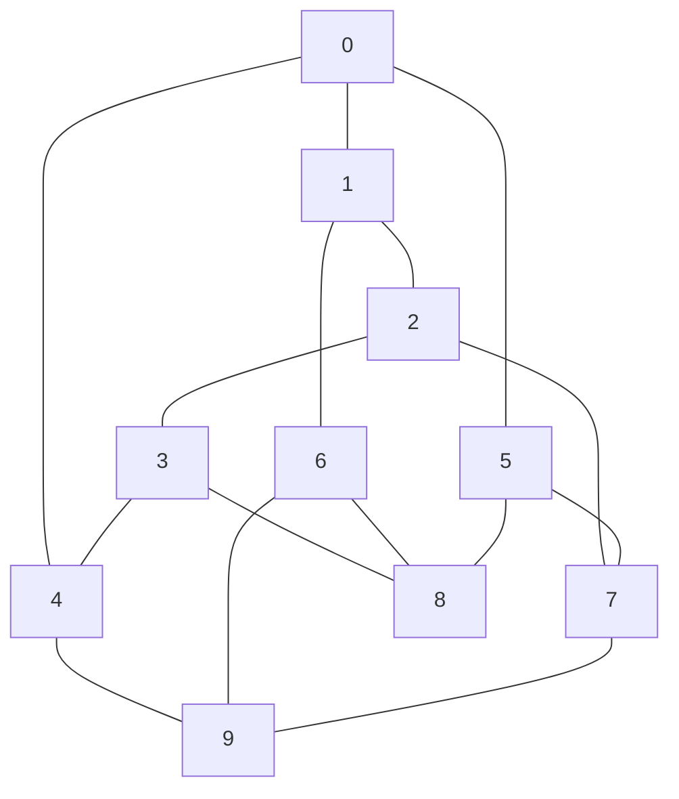
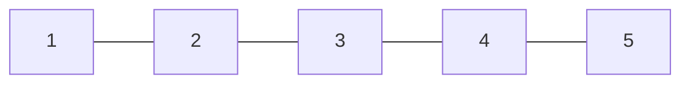
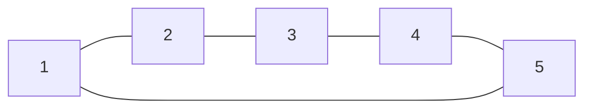

---
{"publish":true,"created":"28/10/25, 17:10","modified":"2026-03-24T15:00:28.425+02:00","tags":["Academia","Lecture","Discrete-structures"],"cssclasses":""}
---

> [!IMPORTANT] Book
> Nati Linial, "Discrete mathematics"

$$
\displaylines{
G = (V, E) \\
E \subseteq \binom{V}{2} \\
\text{Note} - \forall S: \binom{S}{k} = \Set{ R \subset S | \left\lvert R \right\rvert = k } \\
}
$$
## Existence of a simple path #lemma 
$$
\displaylines{
\text{Let there exist a walk between } v, u \\
\text{Then there exists a simple path between } v, u \\
\\
\text{Proof:} \\
\text{Let } p \text{ be a shortest walk between } v, u \\
\text{Let by contradiction } p \text{ be not a simple path} \\
\implies \exists w \in V: w \text{ is used twice in } p \\
\implies p = (v, p_{i}, w, \dots, w, p_{j}, u) \\
\implies \exists p' = (v, p_{i}, w, p_{j}, u) \text{ which is shorter than } p \\
\text{Contradiction!} \implies \boxed{ p \text{ is a simple path} } \\
}
$$
- Longest walk in a graph can have length $\infty$
- Longest path in a graph can have length $\left\lvert E \right\rvert$
- Longest simple path in a graph can have length $\left\lvert V \right\rvert - 1$
## Spanning subgraph #definition 
$$
\displaylines{
\text{Subgraph $H$ is called a spanning subgraph of graph } G \\
\text{ iff } V_{H} = V_{G} \\
}
$$
## Induced subgraph #definition 
$$
\displaylines{
\text{Subgraph $H$ is called an induced subgraph if it is obtained by} \\
\text{only deleting vertices from graph } G \\
\text{Induced subgraph is denotes as } G[A] \text{ where } A \subseteq V \text{ is a set of all vertices of } H \\
\\
\text{Alternatively, induced subgraph $G[A]$ is a subgraph with all possible edges on set } A \\
}
$$
>[!NOTE] Observation
>Each connected component is an induced subgraph
## Clique #definition 
$$
\displaylines{
G = \left(V, \binom{V}{2}\right) \implies \left\lvert E \right\rvert = \binom{n}{2} \\
\\
\forall G = (V, E): \text{subset $A$ of } V \text{ is called a clique iff } \binom{A}{2} \subseteq E \\
\forall G = (V, E): \text{subset $A$ of } V \text{ is called independent iff } \binom{A}{2} \cap E = \emptyset \\
}
$$
## Complement graph #definition 
$$
\displaylines{
\text{Complement graph is a graph containing all edges that are not in } G \\
G = (V, E) \implies \overline{G} = \left( V, \binom{V}{2} \setminus E \right) \\
\\
A \text{ is a clique in } G \iff A \text{ is independent in } \overline{G} \\
A \text{ is a clique in } \overline{G} \iff A \text{ is independent in } G \\
}
$$
## Path graph #definition 

$$
\displaylines{
G = (V, E) \\
\left\lvert E \right\rvert = n - 1 \\
}
$$
## Cycle graph #definition 

$$
\displaylines{
G = (V, E) \\
\left\lvert E \right\rvert = n \\
}
$$
## d-regular graph #definition 
$$
\displaylines{
G = (V, E) \\
\forall v \in V: deg(v) = d \\
\\
\text{Examples: cycle, clique, Petersen graph} \\
}
$$
# Kneser graph #definition 
$$
\displaylines{
KG_{n,k} = (V, E) \\
V = \binom{[n]}{k} = \Set{ A \subseteq [n] | \left\lvert A \right\rvert = k } \\
E = \Set{ \Set{ A, B } | A, B \in V : A \cap B = \emptyset } \\
\\
KG_{5, 2} \text{ is a Petersen graph} \\
}
$$
Kneser graph has $\binom{n}{k}$ vertices and is a regular graph with degree of each vertex being $\binom{n-k}{k}$
$$
\implies \left\lvert E \right\rvert = \frac{1}{2} \sum_{v \in V} deg(v) = \frac{1}{2} \binom{n}{k} \binom{n-k}{k} \\
$$
If $n \leq 2k-1$ then $KG_{n, k}$ is an empty graph
$$
\forall n : KG_{n,1} = K_{n} \\
$$
Maximal clique in $KG_{n,k}$ is $K_{\lfloor \frac{n}{k} \rfloor}$
Maximal independent set in $KG_{n,k}$ is of size $\binom{n-1}{k-1}$

---
# Introduction to Cardinal numbers
How can one measure the size of a set?
$$
\displaylines{
\mathbb{N}? \ \mathbb{Z}? \ \mathbb{R}? \ \mathbb{C}? \\
P(\mathbb{N})? \ \Set{ 0, 1 }^{\mathbb{R}}? \\
}
$$
> [!NOTE] Zero
> Zero here is assumed to be included in $\mathbb{N}$

## Cardinality #definition
$$
\displaylines{
\text{Sets } A, B \text{ are said to have the same cardinality (size, to some extent),} \\
\text{or so called equinumerous sets iff there exists a bijective function } f: A \to B \\
\text{Denoted as } A \sim B \text{ or } \lvert A \rvert = \lvert B \rvert \\
}
$$
## Finite sets #definition 
$$
\displaylines{
\text{For each } n \in \mathbb{N} \\
\text{Define } I_{n} = \Set{ 0, 1, 2, \dots, n } \\
I_{0} = \Set{  } = \emptyset \\
\text{Set } A \text{ is called finite iff there exists } n \in \mathbb{N} \\
\text{such that } A \sim I_{n} \\
\text{In this case, we denote it as } \lvert A \rvert = n \\
\text{If there is no such } n, \text{ then } A \text{ is called an infinite set} \\
}
$$
## Relation "have the same cardinality" #definition 
$$
\displaylines{
\text{Let} \sim \text{be a relation on } P(X) \\
\sim \text{ is reflexive, } \forall A \in P(X): A \sim A, \text{ we use } I_{A}: A \to A \text{ to show it} \\
\sim \text{ is symmetric, } A \sim B \implies B \sim A, \text{we use } f^{-1}: B \to A \text{ to show this} \\
\sim \text{ is transitive, } A \sim B \land B \sim C \implies A \sim C, \text{ we use } (g \circ f): A \to C \text{ to show this} \\
\implies \boxed{ \sim \text{ is an equivalence relation} } \\
}
$$
## Dominating set #definition 
$$
\displaylines{
B \text{ dominates } A, \text{ denoted } A \preccurlyeq B \text{ iff there exists injective function } f: A \to B \\
\\
A \precneqq B \iff A \preccurlyeq B \land A \not\sim B \\
}
$$
## Cardinality equality claims #lemma 
$$
\displaylines{
\mathbb{N} \sim \mathbb{N}_{\geq 1} \\
f: \mathbb{N} \to \mathbb{N}_{\geq 1}, f(n) = n+1 \text{ is bijective} \\
}
$$
---
$$
\displaylines{
\mathbb{N} \sim E = \Set{ 0, 2, 4, \dots } \\
f: \mathbb{N} \to E, f(n) = 2n \text{ is bijective} \\
}
$$
---
$$
\displaylines{
\forall a, b, c, d \in \mathbb{R}: [a, b] \sim [c, d] \\
f: [a, b] \to [c, d], f(x) = (x-a) \cdot \frac{d-c}{b-a} + c \\
f(a) = c, f(b) = d, f \text{ is monotonically increasing} \implies f \text{ is bijective} \\
\\
\text{Same functions shows:} \\
(a, b) \sim (c, d) \\
(a, b] \sim (c, d] \\
[a, b) \sim [c, d) \\
}
$$
---
$$
\displaylines{
(0, 1) \sim (0, 1] \\
f: (0, 1) \to (0, 1], f(x) = \left\{\begin{array}{}
\frac{1}{n-1} & \exists n \in \mathbb{N}_{>1} : x = \frac{1}{n} \\
x \\
\end{array}\right. \\
}
$$
---
$$
\displaylines{
(0, 1) \sim \mathbb{R} \\
g: (0, 1) \to \mathbb{R}, g(x) = \frac{1-2x}{x(1-x)} \\
\text{Monotonicity proves injectivity} \\
\text{IVT proves surjectivity} \\
\implies g \text{ is bijective} \\
\\
\text{Alternative:} \\
f: \left( -\frac{\pi}{2}, \frac{\pi}{2} \right) \to \mathbb{R}, f(x) = \tan(x) \\
\implies (0, 1) \sim \left( \frac{\pi}{2}, \frac{\pi}{2} \right) \sim \mathbb{R} \implies (0, 1) \sim \mathbb{R} \\
}
$$
---
$$
\displaylines{
\mathbb{N} \sim \mathbb{N} \times \mathbb{N} \\
\text{Let } \leq \text{ be an order on } \mathbb{N} \times \mathbb{N} \\
(n, m) < (n', m') \iff n + m < n' + m' \text{ or } (n + m = n' + m' \land m < m') \\
\leq \text{ is a total order} \\
f: \mathbb{N} \times \mathbb{N} \to \mathbb{N} : f((n, m)) = \left\lvert \Set{ (n', m') | (n', m') < (n, m) } \right\rvert \\
(n, m) < (n', m') \implies f(n, m) < f(n', m') \implies f \text{ is injective} \\
\text{Surjectivity is proved by induction} \\
\\
\text{or } f(n, m) = (1 + 2 + 3 + \dots + (n + m)) = \frac{1}{2}((n+m)^{2} + 3m + n) \\
}
$$
> [!WARNING]
> Not every total order gives us a bijective function or a function at all!
---

## Equinumerous cartesian products #lemma 
$$
\displaylines{
\text{Let } A_{1} \sim A_{2}, B_{1} \sim B_{2} \\
\text{Then } A_{1} \times B_{1} \sim A_{2} \times B_{2} \\
\\
f_{A}: A_{1} \to A_{2} \\
f_{B}: B_{1} \to B_{2} \\
f: A_{1} \times B_{1} \to A_{2} \times B_{2}, f(a_{1}, b_{1}) = (f_{A}(a_{1}), f_{B}(b_{1})) \\
\text{Injectivity:} \\
(x, y) \neq (x', y') \implies f_{A}(x) \neq f_{A}(x') \text{ or } f_{B}(y) \neq f_{B}(y') \\
\implies f(x, y) \neq f(x', y') \\
\\
\text{Surjectivity:} \\
\forall (x, y) \in A_{1} \times B_{1} : \exists f_{A}(x), f_{B}(y) \\
\implies \exists f(x, y) = (f_{A}(x), f_{B}(y)) \\
}
$$
---
$$
\displaylines{
\forall n: \mathbb{N} \sim \mathbb{N}^{n} \\
\\
\text{By induction:} \\
\underbrace{ \mathbb{N} }_{ A_{1} } \sim \underbrace{ \mathbb{N} }_{ A_{2} }, \underbrace{ \mathbb{N} }_{ B_{1} } \sim \underbrace{ \mathbb{N}^{2} }_{ B_{2} } \implies \underbrace{ \mathbb{N}^{2} }_{ A_{1} \times B_{1} } \sim \underbrace{ \mathbb{N} \times \mathbb{N}^{2} }_{ A_{2} \times B_{2} } \sim \mathbb{N}^{3} \\
\implies \dots \implies \mathbb{N} \sim \mathbb{N} \times \mathbb{N}^{n} \sim \mathbb{N}^{n+1} \\
}
$$
---
## Countable set #definition 
$$
\displaylines{
\text{Cardinality of } \mathbb{N} \text{ is denoted as } \aleph_{0} \\
\text{Set $S$ is called countable iff } S \preccurlyeq \mathbb{N} \\
}
$$
